# PlannerHQ — Production MVP Implementation Blueprint

> [!IMPORTANT]
> This is a living document. Every section directly maps to the PlannerHQ requirements spec, the existing codebase, and the AGENTS.md rules. It is designed to be executed sprint-by-sprint by a team of engineers.

---

## Table of Contents

1. [Product Breakdown](#1-product-breakdown)
2. [MVP Scope Definition](#2-mvp-scope-definition)
3. [System Architecture](#3-system-architecture)
4. [Multi-Tenant Design](#4-multi-tenant-design)
5. [Database Design](#5-database-design)
6. [ER Diagram](#6-er-diagram)
7. [Supabase Design](#7-supabase-design)
8. [Row Level Security (RLS)](#8-row-level-security-rls)
9. [Frontend Architecture](#9-frontend-architecture)
10. [UI Architecture](#10-ui-architecture)
11. [Realtime Collaboration Design](#11-realtime-collaboration-design)
12. [API & Service Layer Design](#12-api--service-layer-design)
13. [File Storage Design](#13-file-storage-design)
14. [Notification Architecture](#14-notification-architecture)
15. [Razorpay Billing Architecture](#15-razorpay-billing-architecture)
16. [Google Integration Architecture](#16-google-integration-architecture)
17. [Security Architecture](#17-security-architecture)
18. [Performance & Scalability](#18-performance--scalability)
19. [Testing Strategy](#19-testing-strategy)
20. [CI/CD & Deployment](#20-cicd--deployment)
21. [Sprint-Based Roadmap](#21-sprint-based-roadmap)
22. [Risk Analysis](#22-risk-analysis)
23. [Phase 2 AI Architecture](#23-phase-2-ai-architecture)
24. [Final Deliverables](#24-final-deliverables)

---

## User Feedback — Incorporated

Based on your inline comments:

| Comment | Decision |
|---|---|
| No offline support — if offline then pause working | **No offline mode**. Yjs providers will detect disconnect and show a "You are offline — changes paused" banner. No local persistence of Yjs docs. |
| Payments will be Razorpay based. Payment integration added later. | **Razorpay** replaces Stripe. Section 15 designs the full Razorpay lifecycle. Billing sprint (Sprint 11) is positioned late intentionally. |
| Presence & Cursors — future implementation, not now | **Live cursors deferred to Phase 2**. MVP ships real-time document sync (Yjs) without cursor rendering. Awareness API stubs will be wired but cursor UI is skipped. |

---

## 1. Product Breakdown

```
PlannerHQ
├── Authentication
│   ├── Registration (Name, Email, Password)
│   ├── Email OTP Verification
│   ├── Login (Email + Password)
│   ├── Google OAuth (Phase 2 — future)
│   ├── Forgot Password / Reset
│   ├── Session Management (7-day expiry)
│   └── Logout
│
├── User Profile
│   ├── Display Name / Avatar
│   ├── HQID (unique public identifier)
│   ├── Email Settings
│   └── Theme Preference
│
├── Workspace Management
│   ├── Create Workspace
│   ├── Workspace Settings (name, icon, description)
│   ├── Workspace Members
│   │   ├── Invite via Email
│   │   ├── Invite via HQID
│   │   ├── Accept / Reject Invitation
│   │   └── Remove Member
│   ├── Workspace Roles
│   │   ├── Owner
│   │   ├── Admin
│   │   ├── Editor
│   │   ├── Viewer
│   │   └── Custom Roles (Enterprise)
│   ├── Workspace Deletion (soft-delete → purge)
│   └── Workspace Switching
│
├── Sections & Pages (OneNote-style)
│   ├── Create Section
│   ├── Rename / Reorder Sections
│   ├── Delete Section
│   ├── Create Page (within Section)
│   ├── Page Metadata (title, icon, cover)
│   ├── Page Tree / Navigation
│   └── Move Page between Sections
│
├── Documents & Editor
│   ├── Rich Text Editor (Tiptap)
│   │   ├── Headings, Paragraphs, Lists
│   │   ├── Bold, Italic, Underline, Strikethrough
│   │   ├── Code Blocks
│   │   ├── Block Quotes
│   │   ├── Tables
│   │   ├── Inline Images
│   │   ├── Embeds (links, videos)
│   │   ├── Checklists / Todo
│   │   ├── Dividers
│   │   └── Slash Commands
│   ├── Real-time Collaboration (Yjs)
│   │   ├── Multi-user simultaneous editing
│   │   ├── Presence indicators (who is viewing)
│   │   └── Awareness API (user list, status)
│   ├── Version History
│   │   ├── Auto-snapshot on save
│   │   ├── Named versions
│   │   ├── Version diffing
│   │   └── Restore to version
│   ├── Document Sharing
│   │   ├── Share via HQID
│   │   ├── Share via invitation link
│   │   ├── Public link (view-only)
│   │   ├── Private link (authenticated)
│   │   └── Guest access (no account required for public)
│   └── Autosave
│
├── Task Management
│   ├── Create Task
│   ├── Task Properties
│   │   ├── Title, Description
│   │   ├── Status (Todo, In Progress, Done, Blocked)
│   │   ├── Priority (None, Low, Medium, High, Urgent)
│   │   ├── Due Date
│   │   ├── Assignees
│   │   ├── Labels / Tags
│   │   └── Subtasks
│   ├── Task Views
│   │   ├── List View
│   │   ├── Board View (Kanban)
│   │   └── Calendar View
│   ├── Task Filters & Sort
│   ├── Task Assignments
│   └── Task Comments
│
├── Calendar
│   ├── Month / Week / Day Views
│   ├── Create / Edit / Delete Events
│   ├── Event Properties
│   │   ├── Title, Description
│   │   ├── Start / End Date-Time
│   │   ├── Location
│   │   ├── Attendees
│   │   ├── Recurrence
│   │   └── Reminders
│   ├── Task-Calendar Integration (due dates on calendar)
│   ├── Google Calendar Sync (Enterprise)
│   └── Google Meet Link Generation (Enterprise)
│
├── Workspace Chat
│   ├── Chat Rooms (workspace-scoped)
│   ├── Direct Messages (member-to-member)
│   ├── Message Types (text, file, mention)
│   ├── Typing Indicators
│   ├── Read Receipts
│   └── Message Search
│
├── Notifications
│   ├── In-App Notification Center
│   │   ├── Task assignments
│   │   ├── Mentions
│   │   ├── Document shares
│   │   ├── Workspace invitations
│   │   ├── Calendar reminders
│   │   └── Chat messages
│   ├── Email Notifications (digest)
│   ├── Browser Push Notifications
│   └── Notification Preferences
│
├── File Management
│   ├── File Upload (inline in editor, task attachments)
│   ├── File Browser (per workspace)
│   ├── Storage Quota Tracking
│   ├── Signed URLs (secure access)
│   └── File Type Validation
│
├── Billing & Subscriptions
│   ├── Plan Selection (Free, Pro, Plus, Enterprise)
│   ├── Razorpay Checkout
│   ├── Subscription Lifecycle (create, upgrade, downgrade, cancel)
│   ├── Usage Metering
│   ├── Feature Gating / Entitlement Enforcement
│   └── Invoicing
│
├── Settings
│   ├── User Settings (profile, email, password, theme)
│   ├── Workspace Settings (name, icon, members, billing)
│   ├── Notification Settings
│   └── Privacy & Security Settings
│
├── Audit Logs (Plus + Enterprise)
│   ├── User Actions Log
│   ├── Admin Actions Log
│   └── Log Retention Policies
│
├── Admin Panel (Workspace Owners/Admins)
│   ├── Member Management
│   ├── Role Management
│   ├── Usage Dashboard
│   └── Billing Management
│
└── AI Features (Phase 2)
    ├── AI Document Assistant
    ├── AI Task Creation
    ├── AI Content Generation
    ├── AI Workspace Insights
    └── AI Usage Tracking / Quotas
```

---

## 2. MVP Scope Definition

### Must-Have Features (MVP — Sprints 1–13)

| Area | Features |
|---|---|
| **Auth** | Email+Password signup, OTP verification, login, forgot password, session management (7-day), logout |
| **Profiles** | User profile (display name, avatar, HQID), user settings |
| **Workspaces** | Create/edit/delete workspace, workspace settings, workspace switching |
| **Members** | Invite via email, invite via HQID, accept/reject, remove member, role assignment |
| **Roles** | Owner, Admin, Editor, Viewer (built-in RBAC) |
| **Sections/Pages** | Section CRUD, page CRUD, page tree navigation, reordering |
| **Editor** | Tiptap rich-text editor (headings, lists, code, tables, images, checklists, slash commands) |
| **Realtime Collab** | Yjs document sync via Supabase Realtime, presence indicators (who is online) |
| **Version History** | Auto-snapshots, named versions, restore (retention by plan) |
| **Sharing** | Share via HQID, invite link, public link (view-only), guest access |
| **Tasks** | Task CRUD, status/priority/due-date/assignees/labels/subtasks, list view, board view |
| **Calendar** | Month/week/day views, event CRUD, task due-dates on calendar |
| **Chat** | Workspace chat rooms, direct messages, text messages, typing indicators |
| **Notifications** | In-app notification center (assignments, mentions, shares, invites, reminders) |
| **Files** | Upload in editor + task attachments, file browser, storage quota tracking, signed URLs |
| **Billing** | Plan display, Razorpay checkout, subscription lifecycle, entitlement enforcement, usage metering |
| **Settings** | User settings, workspace settings, notification preferences |
| **Security** | RLS on all tables, RBAC enforcement, input validation, file validation, rate limiting |

### Should-Have Features (Post-MVP polish)

| Feature | Notes |
|---|---|
| Email notification digests | Requires email service (Resend/SendGrid) |
| Browser push notifications | Requires service worker + push API |
| Task comments | Can be built on chat infrastructure |
| Calendar recurrence | Complex scheduling logic |
| Task calendar view | Cross-feature integration |
| Message search | Full-text search on messages |
| Read receipts | Realtime channel tracking |
| Audit logs (Plus+) | Structured event logging |

### Future Features (Phase 2+)

| Feature | Phase |
|---|---|
| AI Document Assistant | Phase 2 |
| AI Task Creation | Phase 2 |
| AI Content Generation | Phase 2 |
| AI Workspace Insights | Phase 2 |
| Google OAuth | Phase 2 |
| Google Calendar Sync | Phase 2 (Enterprise) |
| Google Meet Integration | Phase 2 (Enterprise) |
| Custom Roles (Enterprise) | Phase 2 |
| Live cursor rendering | Phase 2 |
| SSO / SAML (Enterprise) | Phase 3 |
| Advanced analytics | Phase 3 |

---

## 3. System Architecture

### High-Level Architecture

```
┌─────────────────────────────────────────────────────────────────────────┐
│                              CLIENT TIER                                │
│  ┌───────────────────────────────────────────────────────────────────┐  │
│  │                    Next.js 15 App (Vercel)                        │  │
│  │  ┌──────────┐  ┌──────────┐  ┌───────────┐  ┌────────────────┐  │  │
│  │  │ App      │  │ Features │  │ Hooks     │  │ Services       │  │  │
│  │  │ Router   │  │ (domain) │  │ (queries) │  │ (API clients)  │  │  │
│  │  └────┬─────┘  └────┬─────┘  └─────┬─────┘  └────────┬───────┘  │  │
│  │       │              │              │                  │          │  │
│  │  ┌────▼──────────────▼──────────────▼──────────────────▼───────┐  │  │
│  │  │              Supabase Client (Browser / SSR)                │  │  │
│  │  │  ┌─────────┐  ┌──────────┐  ┌──────────┐  ┌────────────┐  │  │  │
│  │  │  │  Auth   │  │ Database │  │ Realtime │  │  Storage   │  │  │  │
│  │  │  └─────────┘  └──────────┘  └──────────┘  └────────────┘  │  │  │
│  │  └────────────────────────────────────────────────────────────┘  │  │
│  └───────────────────────────────────────────────────────────────────┘  │
│                                                                         │
│  ┌───────────────────────────────────────────────────────────────────┐  │
│  │               Tiptap Editor + Yjs Collaboration Layer             │  │
│  │  ┌──────────────┐  ┌──────────────────┐  ┌───────────────────┐   │  │
│  │  │ Tiptap Core  │  │ Y.Doc (CRDT)     │  │ Supabase Realtime │   │  │
│  │  │ + Extensions │  │ + Awareness API  │  │ Provider (WebSocket)│  │  │
│  │  └──────────────┘  └──────────────────┘  └───────────────────┘   │  │
│  └───────────────────────────────────────────────────────────────────┘  │
└─────────────────────────────────────────────────────────────────────────┘
                                    │
                              HTTPS / WSS
                                    │
┌─────────────────────────────────────────────────────────────────────────┐
│                            SUPABASE TIER                                │
│  ┌────────────┐  ┌──────────┐  ┌───────────────┐  ┌─────────────────┐ │
│  │  Auth      │  │ PostgREST│  │  Realtime     │  │   Storage       │ │
│  │  (GoTrue)  │  │  (REST)  │  │  (WebSocket)  │  │   (S3-compat)   │ │
│  └──────┬─────┘  └────┬─────┘  └───────┬───────┘  └────────┬────────┘ │
│         │              │                │                    │          │
│  ┌──────▼──────────────▼────────────────▼────────────────────▼────────┐ │
│  │                    PostgreSQL Database                             │ │
│  │  ┌────────┐  ┌────────┐  ┌────────┐  ┌────────┐  ┌─────────────┐ │ │
│  │  │ Tables │  │ RLS    │  │ Funcs  │  │ Triggers│  │ Extensions  │ │ │
│  │  │ (30+)  │  │ Policies│  │        │  │         │  │ (pg_cron,   │ │ │
│  │  │        │  │ (per   │  │ (RPC)  │  │(auto-   │  │  pgcrypto,  │ │ │
│  │  │        │  │  table)│  │        │  │ stamp)  │  │  pg_trgm)   │ │ │
│  │  └────────┘  └────────┘  └────────┘  └─────────┘  └─────────────┘ │ │
│  └───────────────────────────────────────────────────────────────────┘ │
│                                                                         │
│  ┌─────────────────┐  ┌──────────────────────────┐                     │
│  │  Edge Functions  │  │  Cron Jobs (pg_cron)      │                    │
│  │  • Razorpay WHK  │  │  • Version history purge  │                    │
│  │  • File cleanup  │  │  • Storage quota recalc   │                    │
│  │  • Email sending │  │  • Notification digest     │                    │
│  └─────────────────┘  └──────────────────────────┘                     │
└─────────────────────────────────────────────────────────────────────────┘
                                    │
                            Webhook / API
                                    │
┌─────────────────────────────────────────────────────────────────────────┐
│                        EXTERNAL SERVICES                                │
│  ┌────────────┐  ┌─────────────┐  ┌──────────────┐  ┌───────────────┐ │
│  │  Razorpay  │  │  Google     │  │  OpenAI      │  │  Email        │ │
│  │  (Payments)│  │  (OAuth,    │  │  (Phase 2)   │  │  (Resend /    │ │
│  │            │  │   Calendar, │  │              │  │   SendGrid)   │ │
│  │            │  │   Meet)     │  │              │  │               │ │
│  └────────────┘  └─────────────┘  └──────────────┘  └───────────────┘ │
└─────────────────────────────────────────────────────────────────────────┘
```

### Service Boundaries

| Boundary | Responsibility | Technology |
|---|---|---|
| **Presentation** | UI rendering, client-side state, routing | Next.js 15 App Router, React 19, Tailwind CSS, Shadcn UI |
| **Feature Logic** | Domain logic, hooks, services | TypeScript modules in `features/` |
| **Data Access** | Supabase client wrapper, query builders | `@supabase/ssr`, TanStack Query |
| **Auth** | Session management, token refresh, middleware guards | Supabase Auth (GoTrue), Next.js middleware |
| **Realtime** | WebSocket channels, document sync, presence | Supabase Realtime, Yjs |
| **Storage** | File upload/download, signed URL generation | Supabase Storage |
| **Billing** | Subscription management, entitlement checks | Razorpay API + Edge Functions |
| **Background** | Scheduled cleanup, digests, quota recalc | Supabase Edge Functions + pg_cron |

### Request Flow (Authenticated Page Load)

```
Browser → Vercel Edge → Next.js Middleware
  │                          │
  │   1. Read session cookie │
  │   2. Verify JWT via      │
  │      Supabase Auth       │
  │                          │
  │   [Valid] ───────────────▼──── Server Component
  │                                │
  │   3. createServerClient()      │
  │   4. Fetch data via PostgREST  │
  │      (RLS applied automatically)
  │                                │
  │   [Render HTML] ◄──────────────┘
  │
  └── Client hydration
       │
       5. createBrowserClient()
       6. Subscribe to Realtime channels
       7. TanStack Query for client-side cache
```

### Authentication Flow

```
┌─────────┐      ┌───────────┐      ┌──────────┐      ┌──────────┐
│ Sign Up │─────▶│ Supabase  │─────▶│  Send    │─────▶│  User    │
│ Form    │      │ Auth      │      │  OTP     │      │  enters  │
│         │      │ signup()  │      │  Email   │      │  OTP     │
└─────────┘      └───────────┘      └──────────┘      └────┬─────┘
                                                            │
                                                    ┌───────▼──────┐
                                                    │ verifyOtp()  │
                                                    │ Supabase Auth│
                                                    └───────┬──────┘
                                                            │
                                              ┌─────────────▼────────────┐
                                              │ Create profile record    │
                                              │ (trigger: on_auth_user_ │
                                              │  created → insert into   │
                                              │  public.profiles)        │
                                              └─────────────┬────────────┘
                                                            │
                                                    ┌───────▼──────┐
                                                    │ Set session  │
                                                    │ cookie (7d)  │
                                                    │ Redirect →   │
                                                    │ /dashboard   │
                                                    └──────────────┘
```

### Realtime Collaboration Flow

```
User A opens doc       User B opens doc
      │                       │
      ▼                       ▼
 new Y.Doc()            new Y.Doc()
      │                       │
      ▼                       ▼
 Connect to              Connect to
 Supabase Realtime       Supabase Realtime
 Channel: doc_{id}       Channel: doc_{id}
      │                       │
      └───────────┬───────────┘
                  │
          ┌───────▼───────┐
          │  Yjs CRDT     │
          │  Sync Protocol│
          │  (via Realtime│
          │   broadcast)  │
          └───────┬───────┘
                  │
          On disconnect:
          ┌───────▼───────┐
          │ Show "offline │
          │ - changes     │
          │ paused" banner│
          └───────────────┘
```

### File Upload Flow

```
Client                      Supabase Storage           PostgreSQL
  │                              │                         │
  │ 1. Check quota (RPC)         │                         │
  │──────────────────────────────┼────────────────────────▶│
  │                              │        quota OK         │
  │◀─────────────────────────────┼─────────────────────────│
  │                              │                         │
  │ 2. Upload file               │                         │
  │─────────────────────────────▶│                         │
  │                              │ 3. Store to bucket      │
  │                              │    (RLS policy checks)  │
  │        signed URL            │                         │
  │◀─────────────────────────────│                         │
  │                              │                         │
  │ 4. Insert file_uploads record│                         │
  │──────────────────────────────┼────────────────────────▶│
  │                              │  5. Trigger updates     │
  │                              │     storage_used on     │
  │                              │     workspace           │
  │                              │                         │
```

### Billing Flow

```
User selects plan → Razorpay Checkout → Payment captured
                                             │
                                    ┌────────▼──────────┐
                                    │ Razorpay Webhook   │
                                    │ → Edge Function    │
                                    │   verify signature │
                                    └────────┬──────────┘
                                             │
                                    ┌────────▼──────────┐
                                    │ Update             │
                                    │ subscriptions      │
                                    │ table (status,     │
                                    │ plan_id, dates)    │
                                    └────────┬──────────┘
                                             │
                                    ┌────────▼──────────┐
                                    │ Recalculate        │
                                    │ entitlements        │
                                    │ (workspace limits)  │
                                    └───────────────────┘
```

---

## 4. Multi-Tenant Design

### Workspace Isolation Model

PlannerHQ uses **shared-schema, workspace-scoped row isolation**. All tenants share the same PostgreSQL tables, and every data row carries a `workspace_id` foreign key. RLS policies enforce that users can only access rows belonging to workspaces they are members of.

```
┌───────────────────────────────────────────┐
│              PostgreSQL                    │
│  ┌─────────────────────────────────────┐  │
│  │          Shared Tables               │  │
│  │  ┌──────────┐  ┌──────────────────┐ │  │
│  │  │ workspace│  │ documents        │ │  │
│  │  │ _id = A  │  │ workspace_id = A │ │  │
│  │  │ _id = B  │  │ workspace_id = A │ │  │
│  │  │ _id = C  │  │ workspace_id = B │ │  │
│  │  └──────────┘  └──────────────────┘ │  │
│  │                                      │  │
│  │  RLS Policy: workspace_id IN         │  │
│  │    (SELECT workspace_id FROM         │  │
│  │     workspace_members                │  │
│  │     WHERE user_id = auth.uid())      │  │
│  └─────────────────────────────────────┘  │
└───────────────────────────────────────────┘
```

**Why shared-schema?**
- Single database, zero provisioning per tenant
- Simple migrations (one schema to update)
- Efficient resource utilization for early-stage SaaS
- RLS provides strong isolation without schema duplication
- Scales to thousands of workspaces on a single Supabase instance
- Easy to migrate to schema-per-tenant later if needed (Enterprise)

### Membership Model

```
User ──── has_many ────▶ WorkspaceMember ◀──── belongs_to ──── Workspace
               │                                      │
               │  role: owner|admin|editor|viewer      │
               │  joined_at, invited_by                │
               └───────────────────────────────────────┘
```

- A user can be a member of **multiple workspaces** (up to plan limit)
- Each membership has a **role** determining permissions
- The **owner** role is unique per workspace (exactly one)
- Roles are enforced at the database level via RLS and via application-level checks

### Ownership Model

| Rule | Implementation |
|---|---|
| Every workspace has exactly one owner | `UNIQUE` constraint on `(workspace_id)` where `role = 'owner'` enforced by trigger |
| Owner cannot be removed | RLS policy prevents DELETE on workspace_members where role = owner |
| Ownership transfer | Dedicated RPC function that atomically swaps roles |
| Owner deletion cascades | Workspace is soft-deleted when owner deletes their account |

### Guest Access Model

Guests are **unauthenticated users** who access content via public share links.

```
Share Link (token) ──▶ share_links table
                        │
                        ├── document_id (what is shared)
                        ├── access_level: 'view' | 'comment'
                        ├── is_public: true
                        ├── expires_at: timestamp | null
                        └── created_by: user_id
```

- Public links → `anon` role accesses via RLS policy checking share_links
- Private links → `authenticated` role with additional token validation
- No document editing for guests (view/comment only)

### Share-Link Access Model

| Share Type | Auth Required | Access Level | RLS Policy |
|---|---|---|---|
| Public view link | No | Read-only | `anon` can SELECT if valid share_link exists with `is_public = true` |
| Private invite link | Yes | Role-based | `authenticated` with matching invite token |
| HQID share | Yes | Role-based | Creates workspace_member or doc_collaborator record |
| Email invite | Yes | Role-based | Creates workspace_invitation → on accept creates workspace_member |

---

## 5. Database Design

> [!NOTE]
> All tables use `uuid` primary keys (Supabase Auth uses UUID for `auth.users.id`). Per Postgres best practices, we use `gen_random_uuid()` as Supabase's default, but recommend migrating to UUIDv7 (`uuid_generate_v7()` via `pg_uuidv7` extension) for time-ordered inserts once enabled. All timestamps use `timestamptz`. Every table has RLS enabled.

### 5.1 profiles

**Purpose**: Extended user profile data. Created automatically via trigger when a user signs up in `auth.users`.

```sql
create table public.profiles (
  id            uuid primary key references auth.users(id) on delete cascade,
  display_name  text not null,
  avatar_url    text,
  hqid          text not null unique,  -- public identifier, e.g., "jane-doe-a3b7"
  email         text not null,
  theme         text not null default 'system' check (theme in ('light', 'dark', 'system')),
  timezone      text default 'UTC',
  created_at    timestamptz not null default now(),
  updated_at    timestamptz not null default now()
);

-- Indexes
create unique index profiles_hqid_idx on public.profiles (hqid);
create index profiles_email_idx on public.profiles (email);

-- RLS
alter table public.profiles enable row level security;
```

### 5.2 plans

**Purpose**: Defines available subscription plans and their feature limits.

```sql
create table public.plans (
  id                    uuid primary key default gen_random_uuid(),
  key                   text not null unique check (key in ('free', 'pro', 'plus', 'enterprise')),
  name                  text not null,
  monthly_price_paise   integer not null default 0, -- Razorpay uses paise (INR) or smallest currency unit
  yearly_price_paise    integer not null default 0,
  currency              text not null default 'INR',
  max_workspaces        integer not null default 3,
  max_sections          integer not null default 2,
  max_storage_bytes     bigint not null default 104857600,  -- 100MB
  max_ai_tokens         bigint not null default 200000,
  ai_token_period       text not null default 'total' check (ai_token_period in ('total', 'daily')),
  max_collaborators     integer not null default 2,
  version_history_days  integer not null default 7,
  max_file_upload_bytes bigint not null default 1048576,    -- 1MB
  max_workspace_admins  integer not null default 0,
  max_tasks_per_ws      integer,       -- null = unlimited
  max_events_per_month  integer,       -- null = unlimited
  audit_log_days        integer default 0,
  has_custom_roles      boolean not null default false,
  has_google_sync       boolean not null default false,
  has_google_meet       boolean not null default false,
  has_sla               boolean not null default false,
  razorpay_plan_id_monthly text,  -- Razorpay plan ID for recurring
  razorpay_plan_id_yearly  text,
  is_active             boolean not null default true,
  created_at            timestamptz not null default now(),
  updated_at            timestamptz not null default now()
);

-- Seed data (see Sprint 1)
-- No RLS needed: plans are public read-only
alter table public.plans enable row level security;
```

### 5.3 subscriptions

**Purpose**: Tracks user subscription state. One active subscription per user.

```sql
create table public.subscriptions (
  id                    uuid primary key default gen_random_uuid(),
  user_id               uuid not null references auth.users(id) on delete cascade,
  plan_id               uuid not null references public.plans(id),
  status                text not null default 'active'
                          check (status in ('active', 'trialing', 'past_due', 'cancelled', 'expired')),
  billing_cycle         text not null default 'monthly'
                          check (billing_cycle in ('monthly', 'yearly')),
  razorpay_subscription_id text,
  razorpay_customer_id     text,
  current_period_start  timestamptz,
  current_period_end    timestamptz,
  trial_end             timestamptz,
  cancelled_at          timestamptz,
  created_at            timestamptz not null default now(),
  updated_at            timestamptz not null default now()
);

-- Indexes
create index subscriptions_user_id_idx on public.subscriptions (user_id);
create index subscriptions_status_idx on public.subscriptions (status);
create unique index subscriptions_user_active_idx on public.subscriptions (user_id) where status in ('active', 'trialing');

-- RLS
alter table public.subscriptions enable row level security;
```

### 5.4 workspaces

**Purpose**: Core workspace entity. Every piece of content belongs to a workspace.

```sql
create table public.workspaces (
  id              uuid primary key default gen_random_uuid(),
  name            text not null,
  slug            text not null,
  description     text,
  icon_url        text,
  owner_id        uuid not null references auth.users(id),
  storage_used    bigint not null default 0,  -- bytes used
  is_deleted      boolean not null default false,
  deleted_at      timestamptz,
  created_at      timestamptz not null default now(),
  updated_at      timestamptz not null default now()
);

-- Indexes
create unique index workspaces_slug_idx on public.workspaces (slug) where is_deleted = false;
create index workspaces_owner_id_idx on public.workspaces (owner_id);

-- RLS
alter table public.workspaces enable row level security;
```

### 5.5 workspace_members

**Purpose**: Many-to-many relationship between users and workspaces with role assignment.

```sql
create table public.workspace_members (
  id              uuid primary key default gen_random_uuid(),
  workspace_id    uuid not null references public.workspaces(id) on delete cascade,
  user_id         uuid not null references auth.users(id) on delete cascade,
  role            text not null default 'viewer'
                    check (role in ('owner', 'admin', 'editor', 'viewer')),
  joined_at       timestamptz not null default now(),
  invited_by      uuid references auth.users(id),
  created_at      timestamptz not null default now(),
  updated_at      timestamptz not null default now()
);

-- Indexes
create unique index workspace_members_ws_user_idx on public.workspace_members (workspace_id, user_id);
create index workspace_members_user_id_idx on public.workspace_members (user_id);
create index workspace_members_workspace_id_idx on public.workspace_members (workspace_id);

-- RLS
alter table public.workspace_members enable row level security;
```

### 5.6 workspace_invitations

**Purpose**: Pending invitations to join a workspace.

```sql
create table public.workspace_invitations (
  id              uuid primary key default gen_random_uuid(),
  workspace_id    uuid not null references public.workspaces(id) on delete cascade,
  email           text,
  hqid            text,
  role            text not null default 'viewer'
                    check (role in ('admin', 'editor', 'viewer')),
  invited_by      uuid not null references auth.users(id),
  token           text not null unique default encode(gen_random_bytes(32), 'hex'),
  status          text not null default 'pending'
                    check (status in ('pending', 'accepted', 'rejected', 'expired')),
  expires_at      timestamptz not null default (now() + interval '7 days'),
  created_at      timestamptz not null default now(),
  updated_at      timestamptz not null default now(),
  constraint invitation_target_check check (email is not null or hqid is not null)
);

-- Indexes
create index workspace_invitations_ws_idx on public.workspace_invitations (workspace_id);
create index workspace_invitations_email_idx on public.workspace_invitations (email);
create index workspace_invitations_hqid_idx on public.workspace_invitations (hqid);
create index workspace_invitations_token_idx on public.workspace_invitations (token);

-- RLS
alter table public.workspace_invitations enable row level security;
```

### 5.7 sections

**Purpose**: OneNote-style sections that group pages within a workspace.

```sql
create table public.sections (
  id              uuid primary key default gen_random_uuid(),
  workspace_id    uuid not null references public.workspaces(id) on delete cascade,
  name            text not null,
  icon            text,
  color           text,
  sort_order      integer not null default 0,
  is_deleted      boolean not null default false,
  created_by      uuid not null references auth.users(id),
  created_at      timestamptz not null default now(),
  updated_at      timestamptz not null default now()
);

-- Indexes
create index sections_workspace_id_idx on public.sections (workspace_id);
create index sections_sort_idx on public.sections (workspace_id, sort_order);

-- RLS
alter table public.sections enable row level security;
```

### 5.8 documents

**Purpose**: Pages/documents within sections. Contains metadata; content is stored as Yjs binary in `document_content`.

```sql
create table public.documents (
  id              uuid primary key default gen_random_uuid(),
  workspace_id    uuid not null references public.workspaces(id) on delete cascade,
  section_id      uuid not null references public.sections(id) on delete cascade,
  parent_id       uuid references public.documents(id) on delete cascade,  -- nested pages
  title           text not null default 'Untitled',
  icon            text,
  cover_url       text,
  sort_order      integer not null default 0,
  is_published    boolean not null default false,
  is_deleted      boolean not null default false,
  deleted_at      timestamptz,
  created_by      uuid not null references auth.users(id),
  last_edited_by  uuid references auth.users(id),
  created_at      timestamptz not null default now(),
  updated_at      timestamptz not null default now()
);

-- Indexes
create index documents_workspace_id_idx on public.documents (workspace_id);
create index documents_section_id_idx on public.documents (section_id);
create index documents_parent_id_idx on public.documents (parent_id);
create index documents_created_by_idx on public.documents (created_by);

-- RLS
alter table public.documents enable row level security;
```

### 5.9 document_content

**Purpose**: Stores the current Yjs document state as binary. Separate from `documents` to avoid loading heavy content during listing queries.

```sql
create table public.document_content (
  document_id     uuid primary key references public.documents(id) on delete cascade,
  content         bytea,           -- Yjs encoded state
  content_text    text,            -- plaintext extraction for search
  content_json    jsonb,           -- Tiptap JSON for server-side rendering
  byte_size       integer not null default 0,
  created_at      timestamptz not null default now(),
  updated_at      timestamptz not null default now()
);

-- RLS
alter table public.document_content enable row level security;
```

### 5.10 document_versions

**Purpose**: Snapshots of document content for version history.

```sql
create table public.document_versions (
  id              uuid primary key default gen_random_uuid(),
  document_id     uuid not null references public.documents(id) on delete cascade,
  version_number  integer not null,
  title           text,
  content         bytea,           -- Yjs snapshot
  content_json    jsonb,           -- Tiptap JSON snapshot
  byte_size       integer not null default 0,
  created_by      uuid not null references auth.users(id),
  label           text,            -- optional named version
  created_at      timestamptz not null default now()
);

-- Indexes
create index doc_versions_document_id_idx on public.document_versions (document_id);
create unique index doc_versions_doc_version_idx on public.document_versions (document_id, version_number);
create index doc_versions_created_at_idx on public.document_versions (created_at);

-- RLS
alter table public.document_versions enable row level security;
```

### 5.11 document_collaborators

**Purpose**: Per-document access grants for users who are not workspace members (cross-workspace sharing).

```sql
create table public.document_collaborators (
  id              uuid primary key default gen_random_uuid(),
  document_id     uuid not null references public.documents(id) on delete cascade,
  user_id         uuid not null references auth.users(id) on delete cascade,
  access_level    text not null default 'view'
                    check (access_level in ('view', 'comment', 'edit')),
  granted_by      uuid not null references auth.users(id),
  created_at      timestamptz not null default now(),
  updated_at      timestamptz not null default now()
);

-- Indexes
create unique index doc_collabs_doc_user_idx on public.document_collaborators (document_id, user_id);
create index doc_collabs_user_id_idx on public.document_collaborators (user_id);

-- RLS
alter table public.document_collaborators enable row level security;
```

### 5.12 tasks

**Purpose**: Task management within workspaces (ClickUp-style).

```sql
create table public.tasks (
  id              uuid primary key default gen_random_uuid(),
  workspace_id    uuid not null references public.workspaces(id) on delete cascade,
  parent_id       uuid references public.tasks(id) on delete cascade,  -- subtasks
  title           text not null,
  description     text,
  status          text not null default 'todo'
                    check (status in ('todo', 'in_progress', 'done', 'blocked', 'cancelled')),
  priority        text not null default 'none'
                    check (priority in ('none', 'low', 'medium', 'high', 'urgent')),
  due_date        timestamptz,
  sort_order      integer not null default 0,
  is_deleted      boolean not null default false,
  created_by      uuid not null references auth.users(id),
  created_at      timestamptz not null default now(),
  updated_at      timestamptz not null default now()
);

-- Indexes
create index tasks_workspace_id_idx on public.tasks (workspace_id);
create index tasks_parent_id_idx on public.tasks (parent_id);
create index tasks_status_idx on public.tasks (workspace_id, status);
create index tasks_due_date_idx on public.tasks (workspace_id, due_date) where due_date is not null;
create index tasks_created_by_idx on public.tasks (created_by);

-- RLS
alter table public.tasks enable row level security;
```

### 5.13 task_assignees

**Purpose**: Many-to-many link between tasks and assigned users.

```sql
create table public.task_assignees (
  id          uuid primary key default gen_random_uuid(),
  task_id     uuid not null references public.tasks(id) on delete cascade,
  user_id     uuid not null references auth.users(id) on delete cascade,
  assigned_by uuid not null references auth.users(id),
  created_at  timestamptz not null default now()
);

-- Indexes
create unique index task_assignees_task_user_idx on public.task_assignees (task_id, user_id);
create index task_assignees_user_id_idx on public.task_assignees (user_id);

-- RLS
alter table public.task_assignees enable row level security;
```

### 5.14 task_labels

**Purpose**: Labels/tags for organizing tasks within a workspace.

```sql
create table public.task_labels (
  id              uuid primary key default gen_random_uuid(),
  workspace_id    uuid not null references public.workspaces(id) on delete cascade,
  name            text not null,
  color           text not null default '#6366f1',
  created_at      timestamptz not null default now()
);

-- Indexes
create unique index task_labels_ws_name_idx on public.task_labels (workspace_id, name);

-- RLS
alter table public.task_labels enable row level security;
```

### 5.15 task_label_assignments

**Purpose**: Many-to-many between tasks and labels.

```sql
create table public.task_label_assignments (
  task_id     uuid not null references public.tasks(id) on delete cascade,
  label_id    uuid not null references public.task_labels(id) on delete cascade,
  primary key (task_id, label_id)
);

-- RLS
alter table public.task_label_assignments enable row level security;
```

### 5.16 calendar_events

**Purpose**: Calendar events within a workspace.

```sql
create table public.calendar_events (
  id              uuid primary key default gen_random_uuid(),
  workspace_id    uuid not null references public.workspaces(id) on delete cascade,
  title           text not null,
  description     text,
  start_at        timestamptz not null,
  end_at          timestamptz not null,
  all_day         boolean not null default false,
  location        text,
  recurrence_rule text,           -- iCal RRULE string (should-have)
  color           text,
  google_event_id text,           -- Enterprise: synced Google Calendar event
  google_meet_url text,           -- Enterprise: generated Meet link
  created_by      uuid not null references auth.users(id),
  created_at      timestamptz not null default now(),
  updated_at      timestamptz not null default now(),
  constraint valid_event_times check (end_at >= start_at)
);

-- Indexes
create index cal_events_workspace_id_idx on public.calendar_events (workspace_id);
create index cal_events_date_range_idx on public.calendar_events (workspace_id, start_at, end_at);
create index cal_events_created_by_idx on public.calendar_events (created_by);

-- RLS
alter table public.calendar_events enable row level security;
```

### 5.17 event_attendees

**Purpose**: Many-to-many between events and attending users.

```sql
create table public.event_attendees (
  id          uuid primary key default gen_random_uuid(),
  event_id    uuid not null references public.calendar_events(id) on delete cascade,
  user_id     uuid not null references auth.users(id) on delete cascade,
  rsvp_status text not null default 'pending'
                check (rsvp_status in ('pending', 'accepted', 'declined', 'tentative')),
  created_at  timestamptz not null default now()
);

-- Indexes
create unique index event_attendees_event_user_idx on public.event_attendees (event_id, user_id);
create index event_attendees_user_id_idx on public.event_attendees (user_id);

-- RLS
alter table public.event_attendees enable row level security;
```

### 5.18 chat_rooms

**Purpose**: Chat channels within a workspace or direct message threads.

```sql
create table public.chat_rooms (
  id              uuid primary key default gen_random_uuid(),
  workspace_id    uuid not null references public.workspaces(id) on delete cascade,
  name            text,
  type            text not null default 'channel'
                    check (type in ('channel', 'direct')),
  is_default      boolean not null default false,  -- #general channel
  created_by      uuid not null references auth.users(id),
  created_at      timestamptz not null default now(),
  updated_at      timestamptz not null default now()
);

-- Indexes
create index chat_rooms_workspace_id_idx on public.chat_rooms (workspace_id);

-- RLS
alter table public.chat_rooms enable row level security;
```

### 5.19 chat_room_members

**Purpose**: Membership in chat rooms (for DMs and private channels).

```sql
create table public.chat_room_members (
  chat_room_id    uuid not null references public.chat_rooms(id) on delete cascade,
  user_id         uuid not null references auth.users(id) on delete cascade,
  last_read_at    timestamptz default now(),
  created_at      timestamptz not null default now(),
  primary key (chat_room_id, user_id)
);

-- Indexes
create index chat_room_members_user_id_idx on public.chat_room_members (user_id);

-- RLS
alter table public.chat_room_members enable row level security;
```

### 5.20 messages

**Purpose**: Chat messages in a room.

```sql
create table public.messages (
  id              uuid primary key default gen_random_uuid(),
  chat_room_id    uuid not null references public.chat_rooms(id) on delete cascade,
  sender_id       uuid not null references auth.users(id),
  content         text not null,
  message_type    text not null default 'text'
                    check (message_type in ('text', 'file', 'system')),
  file_url        text,
  file_name       text,
  is_edited       boolean not null default false,
  is_deleted      boolean not null default false,
  created_at      timestamptz not null default now(),
  updated_at      timestamptz not null default now()
);

-- Indexes
create index messages_chat_room_id_idx on public.messages (chat_room_id, created_at desc);
create index messages_sender_id_idx on public.messages (sender_id);

-- RLS
alter table public.messages enable row level security;
```

### 5.21 notifications

**Purpose**: In-app notifications for all event types.

```sql
create table public.notifications (
  id              uuid primary key default gen_random_uuid(),
  user_id         uuid not null references auth.users(id) on delete cascade,
  workspace_id    uuid references public.workspaces(id) on delete cascade,
  type            text not null check (type in (
    'task_assigned', 'task_updated', 'task_due',
    'mention', 'comment',
    'document_shared', 'document_updated',
    'workspace_invitation', 'member_joined', 'member_removed',
    'calendar_reminder', 'calendar_invite',
    'chat_message', 'chat_mention',
    'system'
  )),
  title           text not null,
  body            text,
  entity_type     text,            -- 'task', 'document', 'workspace', 'event', 'chat'
  entity_id       uuid,            -- polymorphic reference
  actor_id        uuid references auth.users(id),  -- who triggered the notification
  is_read         boolean not null default false,
  read_at         timestamptz,
  created_at      timestamptz not null default now()
);

-- Indexes
create index notifications_user_id_idx on public.notifications (user_id, created_at desc);
create index notifications_user_unread_idx on public.notifications (user_id) where is_read = false;
create index notifications_workspace_idx on public.notifications (workspace_id);

-- RLS
alter table public.notifications enable row level security;
```

### 5.22 notification_preferences

**Purpose**: Per-user notification delivery preferences.

```sql
create table public.notification_preferences (
  id              uuid primary key default gen_random_uuid(),
  user_id         uuid not null references auth.users(id) on delete cascade,
  type            text not null,  -- matches notification type
  in_app          boolean not null default true,
  email           boolean not null default false,
  push            boolean not null default false,
  created_at      timestamptz not null default now(),
  updated_at      timestamptz not null default now()
);

-- Indexes
create unique index notif_prefs_user_type_idx on public.notification_preferences (user_id, type);

-- RLS
alter table public.notification_preferences enable row level security;
```

### 5.23 file_uploads

**Purpose**: Registry of all uploaded files with metadata.

```sql
create table public.file_uploads (
  id              uuid primary key default gen_random_uuid(),
  workspace_id    uuid not null references public.workspaces(id) on delete cascade,
  uploaded_by     uuid not null references auth.users(id),
  file_name       text not null,
  file_type       text not null,        -- MIME type
  file_size       bigint not null,      -- bytes
  storage_path    text not null unique,  -- path in Supabase Storage bucket
  entity_type     text,                 -- 'document', 'task', 'message', 'avatar', 'workspace'
  entity_id       uuid,                 -- polymorphic reference
  created_at      timestamptz not null default now()
);

-- Indexes
create index file_uploads_workspace_id_idx on public.file_uploads (workspace_id);
create index file_uploads_entity_idx on public.file_uploads (entity_type, entity_id);
create index file_uploads_uploaded_by_idx on public.file_uploads (uploaded_by);

-- RLS
alter table public.file_uploads enable row level security;
```

### 5.24 share_links

**Purpose**: Shareable links for documents (public and private).

```sql
create table public.share_links (
  id              uuid primary key default gen_random_uuid(),
  document_id     uuid not null references public.documents(id) on delete cascade,
  workspace_id    uuid not null references public.workspaces(id) on delete cascade,
  token           text not null unique default encode(gen_random_bytes(32), 'hex'),
  access_level    text not null default 'view'
                    check (access_level in ('view', 'comment')),
  is_public       boolean not null default true,   -- anon can access
  is_active       boolean not null default true,
  password_hash   text,                             -- optional password protection
  expires_at      timestamptz,
  max_uses        integer,
  use_count       integer not null default 0,
  created_by      uuid not null references auth.users(id),
  created_at      timestamptz not null default now(),
  updated_at      timestamptz not null default now()
);

-- Indexes
create index share_links_document_id_idx on public.share_links (document_id);
create index share_links_token_idx on public.share_links (token);

-- RLS
alter table public.share_links enable row level security;
```

### 5.25 audit_logs

**Purpose**: Action audit trail for Plus and Enterprise plans.

```sql
create table public.audit_logs (
  id              uuid primary key default gen_random_uuid(),
  workspace_id    uuid not null references public.workspaces(id) on delete cascade,
  actor_id        uuid references auth.users(id),
  action          text not null,        -- 'member.invited', 'document.deleted', etc.
  entity_type     text not null,        -- 'workspace', 'document', 'task', 'member'
  entity_id       uuid,
  metadata        jsonb default '{}',   -- additional context
  ip_address      inet,
  user_agent      text,
  created_at      timestamptz not null default now()
);

-- Indexes
create index audit_logs_workspace_id_idx on public.audit_logs (workspace_id, created_at desc);
create index audit_logs_actor_id_idx on public.audit_logs (actor_id);
create index audit_logs_action_idx on public.audit_logs (action);

-- Partition by month for large-scale (future optimization)

-- RLS
alter table public.audit_logs enable row level security;
```

### 5.26 google_integrations

**Purpose**: Stores Google OAuth tokens for Calendar/Meet integration (Enterprise).

```sql
create table public.google_integrations (
  id              uuid primary key default gen_random_uuid(),
  user_id         uuid not null references auth.users(id) on delete cascade,
  workspace_id    uuid not null references public.workspaces(id) on delete cascade,
  access_token    text not null,        -- encrypted at rest
  refresh_token   text not null,        -- encrypted at rest
  token_expires_at timestamptz not null,
  scopes          text[] not null default '{}',
  is_active       boolean not null default true,
  created_at      timestamptz not null default now(),
  updated_at      timestamptz not null default now()
);

-- Indexes
create unique index google_integ_user_ws_idx on public.google_integrations (user_id, workspace_id);

-- RLS
alter table public.google_integrations enable row level security;
```

### 5.27 ai_usage_tracking

**Purpose**: Tracks AI token consumption per user for quota enforcement (Phase 2).

```sql
create table public.ai_usage_tracking (
  id              uuid primary key default gen_random_uuid(),
  user_id         uuid not null references auth.users(id) on delete cascade,
  workspace_id    uuid not null references public.workspaces(id) on delete cascade,
  tokens_used     bigint not null default 0,
  model           text not null,
  action_type     text not null,        -- 'generate', 'summarize', 'assist'
  created_at      timestamptz not null default now()
);

-- Indexes
create index ai_usage_user_idx on public.ai_usage_tracking (user_id, created_at);
create index ai_usage_workspace_idx on public.ai_usage_tracking (workspace_id, created_at);

-- RLS
alter table public.ai_usage_tracking enable row level security;
```

### 5.28 workspace_settings

**Purpose**: Key-value settings per workspace for extensibility.

```sql
create table public.workspace_settings (
  id              uuid primary key default gen_random_uuid(),
  workspace_id    uuid not null references public.workspaces(id) on delete cascade,
  key             text not null,
  value           jsonb not null default '{}',
  created_at      timestamptz not null default now(),
  updated_at      timestamptz not null default now()
);

-- Indexes
create unique index workspace_settings_ws_key_idx on public.workspace_settings (workspace_id, key);

-- RLS
alter table public.workspace_settings enable row level security;
```

### 5.29 Helper Functions & Triggers

```sql
-- Auto-update updated_at timestamp
create or replace function public.handle_updated_at()
returns trigger as $$
begin
  new.updated_at = now();
  return new;
end;
$$ language plpgsql;

-- Apply to all tables with updated_at
-- (one trigger per table, e.g.):
create trigger set_updated_at before update on public.profiles
  for each row execute function public.handle_updated_at();
-- Repeat for: workspaces, workspace_members, workspace_invitations, sections,
-- documents, document_content, document_collaborators, tasks, calendar_events,
-- chat_rooms, messages, subscriptions, share_links, workspace_settings,
-- notification_preferences, google_integrations

-- Auto-create profile on user signup
create or replace function public.handle_new_user()
returns trigger as $$
begin
  insert into public.profiles (id, display_name, email, hqid)
  values (
    new.id,
    coalesce(new.raw_user_meta_data->>'display_name', split_part(new.email, '@', 1)),
    new.email,
    lower(replace(coalesce(new.raw_user_meta_data->>'display_name', split_part(new.email, '@', 1)), ' ', '-'))
      || '-' || substr(new.id::text, 1, 4)
  );

  -- Create free subscription
  insert into public.subscriptions (user_id, plan_id, status)
  select new.id, p.id, 'active'
  from public.plans p where p.key = 'free';

  return new;
end;
$$ language plpgsql security definer set search_path = '';

create trigger on_auth_user_created
  after insert on auth.users
  for each row execute function public.handle_new_user();

-- Private helper: check workspace membership
create or replace function private.is_workspace_member(ws_id uuid)
returns boolean
language sql
security definer
set search_path = ''
as $$
  select exists (
    select 1 from public.workspace_members
    where workspace_id = ws_id and user_id = (select auth.uid())
  );
$$;

-- Private helper: get user's role in workspace
create or replace function private.get_workspace_role(ws_id uuid)
returns text
language sql
security definer
set search_path = ''
as $$
  select role from public.workspace_members
  where workspace_id = ws_id and user_id = (select auth.uid())
  limit 1;
$$;

-- Revoke direct execution from public roles
revoke execute on function private.is_workspace_member(uuid) from public, anon, authenticated;
revoke execute on function private.get_workspace_role(uuid) from public, anon, authenticated;
```

---

## 6. ER Diagram

```mermaid
erDiagram
    AUTH_USERS {
        uuid id PK
        text email
        jsonb raw_user_meta_data
    }

    PROFILES {
        uuid id PK,FK
        text display_name
        text hqid UK
        text email
        text avatar_url
        text theme
    }

    PLANS {
        uuid id PK
        text key UK
        text name
        int monthly_price_paise
        int max_workspaces
        int max_sections
        bigint max_storage_bytes
        int max_collaborators
    }

    SUBSCRIPTIONS {
        uuid id PK
        uuid user_id FK
        uuid plan_id FK
        text status
        text billing_cycle
        text razorpay_subscription_id
    }

    WORKSPACES {
        uuid id PK
        text name
        text slug UK
        uuid owner_id FK
        bigint storage_used
        bool is_deleted
    }

    WORKSPACE_MEMBERS {
        uuid id PK
        uuid workspace_id FK
        uuid user_id FK
        text role
    }

    WORKSPACE_INVITATIONS {
        uuid id PK
        uuid workspace_id FK
        text email
        text hqid
        text role
        text token UK
        text status
    }

    WORKSPACE_SETTINGS {
        uuid id PK
        uuid workspace_id FK
        text key
        jsonb value
    }

    SECTIONS {
        uuid id PK
        uuid workspace_id FK
        text name
        int sort_order
    }

    DOCUMENTS {
        uuid id PK
        uuid workspace_id FK
        uuid section_id FK
        uuid parent_id FK
        text title
        bool is_published
    }

    DOCUMENT_CONTENT {
        uuid document_id PK,FK
        bytea content
        text content_text
        jsonb content_json
    }

    DOCUMENT_VERSIONS {
        uuid id PK
        uuid document_id FK
        int version_number
        bytea content
        text label
    }

    DOCUMENT_COLLABORATORS {
        uuid id PK
        uuid document_id FK
        uuid user_id FK
        text access_level
    }

    SHARE_LINKS {
        uuid id PK
        uuid document_id FK
        uuid workspace_id FK
        text token UK
        text access_level
        bool is_public
    }

    TASKS {
        uuid id PK
        uuid workspace_id FK
        uuid parent_id FK
        text title
        text status
        text priority
        timestamptz due_date
    }

    TASK_ASSIGNEES {
        uuid id PK
        uuid task_id FK
        uuid user_id FK
    }

    TASK_LABELS {
        uuid id PK
        uuid workspace_id FK
        text name
        text color
    }

    TASK_LABEL_ASSIGNMENTS {
        uuid task_id PK,FK
        uuid label_id PK,FK
    }

    CALENDAR_EVENTS {
        uuid id PK
        uuid workspace_id FK
        text title
        timestamptz start_at
        timestamptz end_at
    }

    EVENT_ATTENDEES {
        uuid id PK
        uuid event_id FK
        uuid user_id FK
        text rsvp_status
    }

    CHAT_ROOMS {
        uuid id PK
        uuid workspace_id FK
        text name
        text type
    }

    CHAT_ROOM_MEMBERS {
        uuid chat_room_id PK,FK
        uuid user_id PK,FK
        timestamptz last_read_at
    }

    MESSAGES {
        uuid id PK
        uuid chat_room_id FK
        uuid sender_id FK
        text content
        text message_type
    }

    NOTIFICATIONS {
        uuid id PK
        uuid user_id FK
        uuid workspace_id FK
        text type
        text title
        bool is_read
    }

    FILE_UPLOADS {
        uuid id PK
        uuid workspace_id FK
        uuid uploaded_by FK
        text file_name
        bigint file_size
        text storage_path UK
    }

    AUDIT_LOGS {
        uuid id PK
        uuid workspace_id FK
        uuid actor_id FK
        text action
        jsonb metadata
    }

    GOOGLE_INTEGRATIONS {
        uuid id PK
        uuid user_id FK
        uuid workspace_id FK
        text access_token
        text refresh_token
    }

    AI_USAGE_TRACKING {
        uuid id PK
        uuid user_id FK
        uuid workspace_id FK
        bigint tokens_used
        text action_type
    }

    NOTIFICATION_PREFERENCES {
        uuid id PK
        uuid user_id FK
        text type
        bool in_app
        bool email
    }

    AUTH_USERS ||--|| PROFILES : "has"
    AUTH_USERS ||--o{ SUBSCRIPTIONS : "has"
    PLANS ||--o{ SUBSCRIPTIONS : "defines"
    AUTH_USERS ||--o{ WORKSPACES : "owns"
    AUTH_USERS ||--o{ WORKSPACE_MEMBERS : "joins"
    WORKSPACES ||--o{ WORKSPACE_MEMBERS : "has"
    WORKSPACES ||--o{ WORKSPACE_INVITATIONS : "has"
    WORKSPACES ||--o{ WORKSPACE_SETTINGS : "has"
    WORKSPACES ||--o{ SECTIONS : "contains"
    SECTIONS ||--o{ DOCUMENTS : "contains"
    DOCUMENTS ||--o{ DOCUMENTS : "parent-child"
    DOCUMENTS ||--|| DOCUMENT_CONTENT : "has content"
    DOCUMENTS ||--o{ DOCUMENT_VERSIONS : "has versions"
    DOCUMENTS ||--o{ DOCUMENT_COLLABORATORS : "shared with"
    DOCUMENTS ||--o{ SHARE_LINKS : "has links"
    WORKSPACES ||--o{ TASKS : "contains"
    TASKS ||--o{ TASKS : "subtasks"
    TASKS ||--o{ TASK_ASSIGNEES : "assigned to"
    WORKSPACES ||--o{ TASK_LABELS : "defines"
    TASKS ||--o{ TASK_LABEL_ASSIGNMENTS : "labeled"
    TASK_LABELS ||--o{ TASK_LABEL_ASSIGNMENTS : "applied"
    WORKSPACES ||--o{ CALENDAR_EVENTS : "contains"
    CALENDAR_EVENTS ||--o{ EVENT_ATTENDEES : "has attendees"
    WORKSPACES ||--o{ CHAT_ROOMS : "contains"
    CHAT_ROOMS ||--o{ CHAT_ROOM_MEMBERS : "has members"
    CHAT_ROOMS ||--o{ MESSAGES : "contains"
    AUTH_USERS ||--o{ NOTIFICATIONS : "receives"
    AUTH_USERS ||--o{ NOTIFICATION_PREFERENCES : "configures"
    WORKSPACES ||--o{ FILE_UPLOADS : "stores"
    WORKSPACES ||--o{ AUDIT_LOGS : "logs"
    AUTH_USERS ||--o{ GOOGLE_INTEGRATIONS : "connects"
    AUTH_USERS ||--o{ AI_USAGE_TRACKING : "uses"
```



---

## 7. Supabase Design

### 7.1 Auth Architecture

| Feature | Implementation |
|---|---|
| **Signup** | `supabase.auth.signUp({ email, password, options: { data: { display_name } } })` → sends OTP to email |
| **OTP Verification** | `supabase.auth.verifyOtp({ email, token, type: 'signup' })` |
| **Login** | `supabase.auth.signInWithPassword({ email, password })` |
| **Forgot Password** | `supabase.auth.resetPasswordForEmail(email)` → magic link |
| **Session** | JWT stored in httpOnly cookies via `@supabase/ssr`, 7-day expiry configured in Supabase dashboard |
| **Logout** | `supabase.auth.signOut()` |
| **Google OAuth** | Phase 2: `supabase.auth.signInWithOAuth({ provider: 'google' })` |
| **Server-side Auth** | `createServerClient()` in `@/lib/supabase/server.ts` using `@supabase/ssr` cookie helpers |
| **Middleware Guard** | Next.js middleware at `src/middleware.ts` refreshes session on every request, redirects unauthenticated users |

### 7.2 Database Architecture

| Aspect | Design |
|---|---|
| **Schema** | All tables in `public` schema (Supabase default) |
| **Private functions** | Helper RLS functions in `private` schema (not exposed to API) |
| **Extensions** | `pgcrypto` (default), `pg_trgm` (text search), `pg_cron` (scheduled jobs) |
| **Migrations** | Generated via `supabase db pull` after iterating with `execute_sql` |
| **Triggers** | `handle_updated_at` (timestamps), `handle_new_user` (profile creation), `update_storage_used` (quota tracking) |
| **RPC Functions** | `accept_invitation`, `transfer_ownership`, `check_quota`, `get_workspace_usage` |

### 7.3 Realtime Architecture

| Channel Pattern | Purpose | Type |
|---|---|---|
| `workspace:{workspace_id}` | Workspace-level events (member changes, settings) | Broadcast |
| `document:{document_id}` | Yjs sync + presence for document editing | Broadcast |
| `chat:{room_id}` | Chat messages, typing indicators | Broadcast + Postgres Changes |
| `notifications:{user_id}` | Real-time notification delivery | Postgres Changes (INSERT on notifications) |
| `tasks:{workspace_id}` | Task updates across workspace | Postgres Changes (on tasks table) |

### 7.4 Storage Architecture

| Bucket | Purpose | Public | RLS |
|---|---|---|---|
| `avatars` | User profile pictures | Yes (read) | Authenticated upload, owner delete |
| `workspace-assets` | Workspace icons, covers | Yes (read) | Members upload, admin delete |
| `documents` | Document inline files (images, attachments) | No | Members with editor+ role |
| `task-attachments` | Task file attachments | No | Members with editor+ role |
| `chat-files` | Chat message attachments | No | Chat room members only |

### 7.5 Edge Functions

| Function | Trigger | Purpose |
|---|---|---|
| `razorpay-webhook` | HTTP POST from Razorpay | Verify webhook signature, update subscription status |
| `send-email` | Invoked by database trigger | Send invitation/notification emails via Resend |
| `cleanup-expired` | pg_cron (daily) | Clean expired invitations, share links, old versions |
| `recalc-storage` | pg_cron (hourly) | Recalculate `workspaces.storage_used` from `file_uploads` |

### 7.6 Cron Jobs

```sql
-- Daily: Clean expired invitations
select cron.schedule(
  'clean-expired-invitations',
  '0 3 * * *',  -- 3 AM daily
  $$update public.workspace_invitations set status = 'expired' where status = 'pending' and expires_at < now()$$
);

-- Daily: Purge old document versions beyond retention
select cron.schedule(
  'purge-old-versions',
  '0 4 * * *',  -- 4 AM daily
  $$
  delete from public.document_versions dv
  using public.documents d
  join public.workspaces w on d.workspace_id = w.id
  join public.workspace_members wm on wm.workspace_id = w.id and wm.role = 'owner'
  join public.subscriptions s on s.user_id = wm.user_id and s.status in ('active', 'trialing')
  join public.plans p on s.plan_id = p.id
  where dv.document_id = d.id
    and dv.created_at < now() - (p.version_history_days || ' days')::interval
  $$
);

-- Hourly: Recalculate storage used
select cron.schedule(
  'recalc-storage',
  '15 * * * *',  -- 15 min past every hour
  $$
  update public.workspaces w set storage_used = coalesce(sub.total, 0)
  from (
    select workspace_id, sum(file_size) as total
    from public.file_uploads
    group by workspace_id
  ) sub
  where w.id = sub.workspace_id
  $$
);
```

---

## 8. Row Level Security (RLS)

> [!IMPORTANT]
> All RLS policies use `(select auth.uid())` pattern (wrapped in subquery) for performance per Supabase Postgres best practices — called once and cached, not per-row.

### 8.1 profiles

```sql
-- Anyone can read profiles (public directory for HQID lookup)
create policy "Profiles are viewable by everyone"
  on public.profiles for select
  to authenticated
  using (true);

-- Users can only update their own profile
create policy "Users can update own profile"
  on public.profiles for update
  to authenticated
  using ((select auth.uid()) = id)
  with check ((select auth.uid()) = id);
```

### 8.2 plans

```sql
-- Plans are read-only for everyone
create policy "Plans are publicly readable"
  on public.plans for select
  to anon, authenticated
  using (true);
```

### 8.3 subscriptions

```sql
-- Users can only see their own subscription
create policy "Users can view own subscription"
  on public.subscriptions for select
  to authenticated
  using ((select auth.uid()) = user_id);

-- Only system (service_role) or Edge Functions update subscriptions
-- No direct update policy for authenticated users
```

### 8.4 workspaces

```sql
-- Members can view their workspaces
create policy "Members can view workspace"
  on public.workspaces for select
  to authenticated
  using ((select private.is_workspace_member(id)));

-- Authenticated users can create workspaces
create policy "Users can create workspaces"
  on public.workspaces for insert
  to authenticated
  with check ((select auth.uid()) = owner_id);

-- Owner/Admin can update workspace
create policy "Owner/Admin can update workspace"
  on public.workspaces for update
  to authenticated
  using (
    (select private.get_workspace_role(id)) in ('owner', 'admin')
  )
  with check (
    (select private.get_workspace_role(id)) in ('owner', 'admin')
  );

-- Only owner can delete (soft-delete) workspace
create policy "Owner can delete workspace"
  on public.workspaces for delete
  to authenticated
  using (
    (select private.get_workspace_role(id)) = 'owner'
  );
```

### 8.5 workspace_members

```sql
-- Members can see other members of their workspaces
create policy "Members can view workspace members"
  on public.workspace_members for select
  to authenticated
  using ((select private.is_workspace_member(workspace_id)));

-- Owner/Admin can add members
create policy "Owner/Admin can add members"
  on public.workspace_members for insert
  to authenticated
  with check (
    (select private.get_workspace_role(workspace_id)) in ('owner', 'admin')
  );

-- Owner/Admin can update member roles
create policy "Owner/Admin can update member roles"
  on public.workspace_members for update
  to authenticated
  using (
    (select private.get_workspace_role(workspace_id)) in ('owner', 'admin')
  )
  with check (
    (select private.get_workspace_role(workspace_id)) in ('owner', 'admin')
    and role != 'owner'  -- cannot promote to owner via policy
  );

-- Owner/Admin can remove members (except owner)
create policy "Owner/Admin can remove members"
  on public.workspace_members for delete
  to authenticated
  using (
    (select private.get_workspace_role(workspace_id)) in ('owner', 'admin')
    and role != 'owner'
  );

-- Members can remove themselves (leave workspace)
create policy "Members can leave workspace"
  on public.workspace_members for delete
  to authenticated
  using (
    (select auth.uid()) = user_id and role != 'owner'
  );
```

### 8.6 sections

```sql
-- Members can view sections
create policy "Members can view sections"
  on public.sections for select
  to authenticated
  using ((select private.is_workspace_member(workspace_id)));

-- Editor+ can create/update sections
create policy "Editors can manage sections"
  on public.sections for insert
  to authenticated
  with check (
    (select private.get_workspace_role(workspace_id)) in ('owner', 'admin', 'editor')
  );

create policy "Editors can update sections"
  on public.sections for update
  to authenticated
  using (
    (select private.get_workspace_role(workspace_id)) in ('owner', 'admin', 'editor')
  )
  with check (
    (select private.get_workspace_role(workspace_id)) in ('owner', 'admin', 'editor')
  );

-- Admin+ can delete sections
create policy "Admins can delete sections"
  on public.sections for delete
  to authenticated
  using (
    (select private.get_workspace_role(workspace_id)) in ('owner', 'admin')
  );
```

### 8.7 documents

```sql
-- Members can view documents + collaborators can view shared docs
create policy "Members can view documents"
  on public.documents for select
  to authenticated
  using (
    (select private.is_workspace_member(workspace_id))
    or exists (
      select 1 from public.document_collaborators dc
      where dc.document_id = id and dc.user_id = (select auth.uid())
    )
  );

-- Public view via share link (anon)
create policy "Public can view shared documents"
  on public.documents for select
  to anon
  using (
    is_published = true
    and exists (
      select 1 from public.share_links sl
      where sl.document_id = id and sl.is_public = true and sl.is_active = true
        and (sl.expires_at is null or sl.expires_at > now())
    )
  );

-- Editor+ can create documents
create policy "Editors can create documents"
  on public.documents for insert
  to authenticated
  with check (
    (select private.get_workspace_role(workspace_id)) in ('owner', 'admin', 'editor')
  );

-- Editor+ can update documents
create policy "Editors can update documents"
  on public.documents for update
  to authenticated
  using (
    (select private.get_workspace_role(workspace_id)) in ('owner', 'admin', 'editor')
    or exists (
      select 1 from public.document_collaborators dc
      where dc.document_id = id and dc.user_id = (select auth.uid()) and dc.access_level = 'edit'
    )
  )
  with check (
    (select private.get_workspace_role(workspace_id)) in ('owner', 'admin', 'editor')
    or exists (
      select 1 from public.document_collaborators dc
      where dc.document_id = id and dc.user_id = (select auth.uid()) and dc.access_level = 'edit'
    )
  );

-- Admin+ can delete documents
create policy "Admins can delete documents"
  on public.documents for delete
  to authenticated
  using (
    (select private.get_workspace_role(workspace_id)) in ('owner', 'admin')
  );
```

### 8.8 tasks

```sql
-- Members can view tasks
create policy "Members can view tasks"
  on public.tasks for select
  to authenticated
  using ((select private.is_workspace_member(workspace_id)));

-- Editor+ can create tasks
create policy "Editors can create tasks"
  on public.tasks for insert
  to authenticated
  with check (
    (select private.get_workspace_role(workspace_id)) in ('owner', 'admin', 'editor')
  );

-- Editor+ can update tasks
create policy "Editors can update tasks"
  on public.tasks for update
  to authenticated
  using (
    (select private.get_workspace_role(workspace_id)) in ('owner', 'admin', 'editor')
  )
  with check (
    (select private.get_workspace_role(workspace_id)) in ('owner', 'admin', 'editor')
  );

-- Admin+ can delete tasks
create policy "Admins can delete tasks"
  on public.tasks for delete
  to authenticated
  using (
    (select private.get_workspace_role(workspace_id)) in ('owner', 'admin')
  );
```

### 8.9 notifications

```sql
-- Users can only see their own notifications
create policy "Users see own notifications"
  on public.notifications for select
  to authenticated
  using ((select auth.uid()) = user_id);

-- Users can update (mark read) their own notifications
create policy "Users update own notifications"
  on public.notifications for update
  to authenticated
  using ((select auth.uid()) = user_id)
  with check ((select auth.uid()) = user_id);
```

### 8.10 messages

```sql
-- Chat room members can view messages
create policy "Room members can view messages"
  on public.messages for select
  to authenticated
  using (
    exists (
      select 1 from public.chat_room_members crm
      where crm.chat_room_id = messages.chat_room_id
        and crm.user_id = (select auth.uid())
    )
  );

-- Room members can send messages
create policy "Room members can send messages"
  on public.messages for insert
  to authenticated
  with check (
    (select auth.uid()) = sender_id
    and exists (
      select 1 from public.chat_room_members crm
      where crm.chat_room_id = messages.chat_room_id
        and crm.user_id = (select auth.uid())
    )
  );
```

> [!NOTE]
> RLS policies for remaining tables (document_content, document_versions, task_assignees, calendar_events, event_attendees, chat_rooms, chat_room_members, file_uploads, share_links, audit_logs, etc.) follow the same patterns — workspace membership check for workspace-scoped data, user_id match for personal data. Full policies will be implemented in each respective sprint.

---

## 9. Frontend Architecture

### Next.js App Router Structure

```
src/
├── app/
│   ├── (auth)/
│   │   ├── signin/page.tsx             ← existing
│   │   ├── signup/page.tsx             ← existing
│   │   ├── verify-otp/page.tsx         ← existing
│   │   ├── forgot-password/page.tsx    ← existing
│   │   ├── reset-password/page.tsx     ← new
│   │   └── layout.tsx                  ← auth layout (no sidebar)
│   │
│   ├── (public)/
│   │   ├── about/page.tsx              ← existing
│   │   ├── pricing/page.tsx            ← existing
│   │   ├── contact/page.tsx            ← existing
│   │   ├── privacy/page.tsx            ← existing
│   │   ├── terms/page.tsx              ← existing
│   │   ├── services/page.tsx           ← existing
│   │   ├── shared/[token]/page.tsx     ← public share view
│   │   └── layout.tsx                  ← public layout (header + footer)
│   │
│   ├── (user)/
│   │   ├── dashboard/page.tsx          ← workspace switcher / home
│   │   ├── settings/
│   │   │   ├── profile/page.tsx
│   │   │   ├── account/page.tsx
│   │   │   ├── notifications/page.tsx
│   │   │   └── layout.tsx
│   │   ├── workspace/[workspaceId]/
│   │   │   ├── page.tsx                ← workspace home
│   │   │   ├── layout.tsx              ← sidebar + topbar layout
│   │   │   ├── documents/
│   │   │   │   ├── page.tsx            ← document list
│   │   │   │   └── [documentId]/
│   │   │   │       ├── page.tsx        ← editor view
│   │   │   │       └── versions/page.tsx
│   │   │   ├── tasks/
│   │   │   │   ├── page.tsx            ← list view (default)
│   │   │   │   ├── board/page.tsx      ← kanban board
│   │   │   │   └── [taskId]/page.tsx   ← task detail
│   │   │   ├── calendar/
│   │   │   │   └── page.tsx            ← calendar view
│   │   │   ├── chat/
│   │   │   │   ├── page.tsx            ← channel list
│   │   │   │   └── [roomId]/page.tsx   ← chat room
│   │   │   ├── files/page.tsx          ← file browser
│   │   │   ├── members/page.tsx        ← member management
│   │   │   └── settings/
│   │   │       ├── general/page.tsx
│   │   │       ├── billing/page.tsx
│   │   │       └── layout.tsx
│   │   └── layout.tsx                  ← authenticated layout
│   │
│   ├── api/
│   │   └── auth/
│   │       └── callback/route.ts       ← OAuth callback handler
│   │
│   ├── globals.css                     ← existing
│   ├── layout.tsx                      ← existing root layout
│   └── page.tsx                        ← existing landing page
│
├── components/
│   ├── ui/                             ← existing Shadcn UI components (42 files)
│   ├── shared/                         ← existing shared components
│   ├── dashboard/
│   │   ├── WorkspaceCard.tsx
│   │   ├── RecentDocuments.tsx
│   │   ├── QuickActions.tsx
│   │   └── UsageSummary.tsx
│   ├── workspace/
│   │   ├── Sidebar.tsx
│   │   ├── Topbar.tsx
│   │   ├── SectionList.tsx
│   │   ├── PageTree.tsx
│   │   ├── MemberList.tsx
│   │   ├── InviteDialog.tsx
│   │   └── WorkspaceSettingsForm.tsx
│   ├── editor/
│   │   ├── TiptapEditor.tsx
│   │   ├── EditorToolbar.tsx
│   │   ├── SlashCommand.tsx
│   │   ├── PresenceAvatars.tsx
│   │   ├── VersionHistory.tsx
│   │   └── extensions/
│   │       ├── index.ts
│   │       ├── SlashCommandExtension.ts
│   │       └── ImageUploadExtension.ts
│   ├── task/
│   │   ├── TaskCard.tsx
│   │   ├── TaskList.tsx
│   │   ├── KanbanBoard.tsx
│   │   ├── KanbanColumn.tsx
│   │   ├── TaskDetailPanel.tsx
│   │   ├── TaskForm.tsx
│   │   └── TaskFilters.tsx
│   ├── calendar/
│   │   ├── CalendarView.tsx
│   │   ├── EventCard.tsx
│   │   ├── EventForm.tsx
│   │   └── MiniCalendar.tsx
│   ├── chat/
│   │   ├── ChatSidebar.tsx
│   │   ├── MessageList.tsx
│   │   ├── MessageInput.tsx
│   │   ├── MessageBubble.tsx
│   │   └── TypingIndicator.tsx
│   ├── notification/
│   │   ├── NotificationCenter.tsx
│   │   ├── NotificationItem.tsx
│   │   └── NotificationBell.tsx
│   ├── billing/
│   │   ├── PlanSelector.tsx
│   │   ├── UsageMeter.tsx
│   │   └── SubscriptionStatus.tsx
│   └── layout/
│       ├── AppShell.tsx
│       ├── PageHeader.tsx
│       └── EmptyState.tsx
│
├── features/
│   ├── auth/
│   │   ├── actions.ts                  ← server actions (signUp, signIn, verifyOtp)
│   │   ├── services.ts                 ← auth service functions
│   │   ├── types.ts
│   │   └── validations.ts              ← Zod schemas
│   ├── workspace/
│   │   ├── actions.ts
│   │   ├── services.ts
│   │   ├── types.ts
│   │   └── validations.ts
│   ├── document/
│   │   ├── actions.ts
│   │   ├── services.ts
│   │   ├── types.ts
│   │   └── validations.ts
│   ├── task/
│   │   ├── actions.ts
│   │   ├── services.ts
│   │   ├── types.ts
│   │   └── validations.ts
│   ├── calendar/
│   │   ├── actions.ts
│   │   ├── services.ts
│   │   ├── types.ts
│   │   └── validations.ts
│   ├── chat/
│   │   ├── actions.ts
│   │   ├── services.ts
│   │   ├── types.ts
│   │   └── validations.ts
│   ├── notification/
│   │   ├── actions.ts
│   │   ├── services.ts
│   │   ├── types.ts
│   │   └── hooks.ts
│   ├── billing/
│   │   ├── actions.ts
│   │   ├── services.ts
│   │   ├── types.ts
│   │   └── entitlements.ts             ← feature gating logic
│   └── file/
│       ├── actions.ts
│       ├── services.ts
│       ├── types.ts
│       └── validations.ts
│
├── hooks/
│   ├── useSupabase.ts                  ← Supabase client hook
│   ├── useAuth.ts                      ← Auth state hook
│   ├── useWorkspace.ts                 ← Current workspace context
│   ├── useRealtime.ts                  ← Generic Realtime subscription hook
│   ├── usePresence.ts                  ← Document presence hook
│   ├── useNotifications.ts             ← Notification subscription
│   ├── useEntitlements.ts              ← Feature gate hook
│   └── useDebounce.ts                  ← Utility
│
├── lib/
│   ├── supabase/
│   │   ├── client.ts                   ← existing browser client
│   │   ├── server.ts                   ← server client (needs implementation)
│   │   ├── middleware.ts               ← middleware client helper
│   │   └── admin.ts                    ← service_role client (server-only)
│   ├── utils.ts                        ← existing (cn utility)
│   ├── constants.ts                    ← app-wide constants
│   └── razorpay.ts                     ← Razorpay SDK wrapper
│
├── services/
│   ├── auth.service.ts                 ← auth API calls
│   ├── workspace.service.ts
│   ├── document.service.ts
│   ├── task.service.ts
│   ├── calendar.service.ts
│   ├── chat.service.ts
│   ├── notification.service.ts
│   ├── billing.service.ts
│   ├── file.service.ts
│   └── share.service.ts
│
├── store/
│   ├── workspace.store.ts              ← Zustand: current workspace state
│   └── notification.store.ts           ← Zustand: notification badge count
│
├── types/
│   ├── types.ts                        ← existing pricing types
│   ├── database.ts                     ← auto-generated Supabase types
│   ├── auth.ts
│   ├── workspace.ts
│   ├── document.ts
│   ├── task.ts
│   ├── calendar.ts
│   ├── chat.ts
│   ├── notification.ts
│   ├── billing.ts
│   └── file.ts
│
├── validations/
│   ├── auth.schema.ts                  ← Zod schemas for auth forms
│   ├── workspace.schema.ts
│   ├── document.schema.ts
│   ├── task.schema.ts
│   ├── calendar.schema.ts
│   └── file.schema.ts
│
├── constants/
│   ├── routes.ts                       ← route path constants
│   ├── roles.ts                        ← role hierarchy
│   └── limits.ts                       ← plan limit constants
│
├── data/
│   └── data.ts                         ← existing pricing page data
│
├── api/                                ← existing (empty)
│
└── middleware.ts                        ← Next.js middleware (auth guard)
```

---

## 10. UI Architecture

### 10.1 Authentication Screens

| Screen | Components | State | API Dependencies |
|---|---|---|---|
| **Sign Up** | SignUpForm, GoogleButton (future), OAuthDivider | email, password, displayName, isLoading, error | `auth.signUp()` |
| **Sign In** | SignInForm, GoogleButton (future), ForgotPasswordLink | email, password, isLoading, error | `auth.signInWithPassword()` |
| **Verify OTP** | OtpInput (6-digit), ResendButton, Timer | otp[], isLoading, resendCooldown, error | `auth.verifyOtp()` |
| **Forgot Password** | EmailInput, SubmitButton | email, isLoading, success | `auth.resetPasswordForEmail()` |
| **Reset Password** | PasswordInput x2, SubmitButton | password, confirmPassword, isLoading | `auth.updateUser()` |

### 10.2 Dashboard

| Screen | Components | State | API Dependencies |
|---|---|---|---|
| **Dashboard Home** | WorkspaceGrid, WorkspaceCard, CreateWorkspaceDialog, RecentDocuments, QuickActions, UsageSummary | workspaces[], recentDocs[], usage | `workspaces.list()`, `documents.recent()`, `subscriptions.current()` |

### 10.3 Workspace

| Screen | Components | State | API Dependencies |
|---|---|---|---|
| **Workspace Layout** | Sidebar (SectionList, PageTree, Navigation), Topbar (breadcrumbs, search, user menu, notification bell) | currentWorkspace, sections[], expandedSections | `workspace.get()`, `sections.list()`, `documents.list()` |
| **Workspace Home** | ActivityFeed, QuickStats, PinnedDocuments | activities[], stats | `workspace.activity()` |
| **Members** | MemberList, InviteDialog, RoleSelector | members[], invitations[] | `members.list()`, `invitations.list()` |

### 10.4 Document Editor

| Screen | Components | State | API Dependencies |
|---|---|---|---|
| **Editor** | TiptapEditor, EditorToolbar, PresenceAvatars, VersionHistoryPanel, ShareDialog | Y.Doc, awareness, content, collaborators[] | `documents.get()`, `document_content.get()`, Realtime channel |
| **Version History** | VersionList, VersionDiff, RestoreButton | versions[], selectedVersion | `document_versions.list()` |

### 10.5 Tasks

| Screen | Components | State | API Dependencies |
|---|---|---|---|
| **Task List** | TaskList, TaskCard, TaskFilters, CreateTaskDialog | tasks[], filters, sortBy | `tasks.list()`, `task_labels.list()` |
| **Kanban Board** | KanbanBoard, KanbanColumn, TaskCard, DragDropContext | tasks grouped by status | `tasks.list()`, `tasks.update()` |
| **Task Detail** | TaskDetailPanel, SubtaskList, AssigneeSelector, LabelSelector, CommentThread | task, subtasks[], assignees[], labels[] | `tasks.get()`, `task_assignees.list()` |

### 10.6 Calendar

| Screen | Components | State | API Dependencies |
|---|---|---|---|
| **Calendar** | CalendarView (month/week/day), EventCard, EventFormDialog, MiniCalendar | events[], viewMode, selectedDate | `calendar_events.list()`, `tasks.withDueDates()` |

### 10.7 Chat

| Screen | Components | State | API Dependencies |
|---|---|---|---|
| **Chat** | ChatSidebar, RoomList, MessageList, MessageInput, MessageBubble, TypingIndicator | rooms[], messages[], typingUsers | `chat_rooms.list()`, `messages.list()`, Realtime channel |

### 10.8 Settings

| Screen | Components | State | API Dependencies |
|---|---|---|---|
| **User Profile** | AvatarUpload, ProfileForm | profile, isEditing | `profiles.get()`, `profiles.update()` |
| **Workspace General** | WorkspaceForm, DangerZone | workspace, isEditing | `workspaces.update()` |
| **Billing** | PlanSelector, UsageMeter, SubscriptionStatus, BillingHistory | subscription, plan, usage | `subscriptions.get()`, `plans.list()` |
| **Notifications** | PreferenceToggles (per type) | preferences[] | `notification_preferences.list()` |

### 10.9 Notifications

| Screen | Components | State | API Dependencies |
|---|---|---|---|
| **Notification Center** | NotificationBell (badge), NotificationDropdown, NotificationItem, MarkAllReadButton | notifications[], unreadCount | `notifications.list()`, Realtime subscription |

---

## 11. Realtime Collaboration Design

### Tiptap + Yjs + Supabase Realtime Architecture

```
┌─────────────────────────────────────────────┐
│                 Client A                     │
│  ┌──────────┐  ┌──────────┐  ┌───────────┐ │
│  │ Tiptap   │──│ Y.Doc    │──│ Supabase  │ │
│  │ Editor   │  │ (CRDT)   │  │ Realtime  │ │
│  │          │  │          │  │ Provider  │ │
│  └──────────┘  └──────────┘  └─────┬─────┘ │
└────────────────────────────────────┼────────┘
                                     │ broadcast
                              ┌──────▼──────┐
                              │  Supabase   │
                              │  Realtime   │
                              │  Channel:   │
                              │  doc:{id}   │
                              └──────┬──────┘
                                     │ broadcast
┌────────────────────────────────────┼────────┐
│                 Client B           │         │
│  ┌──────────┐  ┌──────────┐  ┌─────▼─────┐ │
│  │ Tiptap   │──│ Y.Doc    │──│ Supabase  │ │
│  │ Editor   │  │ (CRDT)   │  │ Realtime  │ │
│  │          │  │          │  │ Provider  │ │
│  └──────────┘  └──────────┘  └───────────┘ │
└─────────────────────────────────────────────┘
```

### Y.Doc Strategy

- **One Y.Doc per document** — each document has its own Yjs document
- **Content stored as Yjs state vector** in `document_content.content` (bytea)
- **On first open**: Load initial state from DB → `Y.applyUpdate(doc, storedState)`
- **On edits**: Yjs generates incremental updates → broadcast via Supabase Realtime
- **On save (debounced 3s)**: `Y.encodeStateAsUpdate(doc)` → upsert to `document_content`
- **Content extraction**: `doc.getXmlFragment('default').toJSON()` → stored as `content_json` for server-side rendering and search

### Awareness API

- **Presence data**: `{ user: { id, name, avatar, color }, cursor: null }` (cursor deferred to Phase 2)
- **Online users**: Displayed as avatar stack in the editor toolbar
- **Stale timeout**: 30 seconds — user removed from awareness after 30s of inactivity

### Conflict Resolution

- **Yjs CRDTs handle all conflicts automatically** — no manual merge needed
- **Last-write-wins for metadata** (title, icon, cover) — these are not in the Y.Doc, updated via standard DB writes with optimistic UI

### Offline Handling (No offline support — per user decision)

```typescript
// Detect disconnect and show banner
realtimeChannel.on('system', { event: 'disconnect' }, () => {
  setIsOffline(true);
  // Disable editor input
  editor.setEditable(false);
  toast.warning('You are offline — editing paused. Reconnecting...');
});

realtimeChannel.on('system', { event: 'reconnect' }, () => {
  setIsOffline(false);
  editor.setEditable(true);
  // Re-sync Y.Doc state
  const currentState = Y.encodeStateAsUpdate(doc);
  // Broadcast full state to re-sync
});
```

### Reconnection Strategy

1. Supabase Realtime client handles automatic reconnection with exponential backoff
2. On reconnect: request full state sync from peers via Yjs sync protocol
3. If no peers are connected: reload state from `document_content` table
4. Show "Reconnecting..." banner during reconnection attempts
5. After 60 seconds of failed reconnection: show "Connection lost" with manual retry button

---

## 12. API & Service Layer Design

### 12.1 Server Actions (Next.js)

Server Actions handle form submissions and mutations from Server Components.

| Feature | Actions | File |
|---|---|---|
| **Auth** | `signUp`, `signIn`, `verifyOtp`, `forgotPassword`, `resetPassword`, `signOut` | `features/auth/actions.ts` |
| **Workspace** | `createWorkspace`, `updateWorkspace`, `deleteWorkspace` | `features/workspace/actions.ts` |
| **Members** | `inviteMember`, `acceptInvitation`, `rejectInvitation`, `removeMember`, `updateMemberRole` | `features/workspace/actions.ts` |
| **Sections** | `createSection`, `updateSection`, `deleteSection`, `reorderSections` | `features/document/actions.ts` |
| **Documents** | `createDocument`, `updateDocument`, `deleteDocument`, `saveContent`, `createVersion` | `features/document/actions.ts` |
| **Sharing** | `createShareLink`, `revokeShareLink`, `addCollaborator`, `removeCollaborator` | `features/document/actions.ts` |
| **Tasks** | `createTask`, `updateTask`, `deleteTask`, `assignTask`, `unassignTask` | `features/task/actions.ts` |
| **Calendar** | `createEvent`, `updateEvent`, `deleteEvent`, `rsvpEvent` | `features/calendar/actions.ts` |
| **Chat** | `createRoom`, `sendMessage`, `editMessage`, `deleteMessage` | `features/chat/actions.ts` |
| **Notifications** | `markAsRead`, `markAllAsRead`, `updatePreferences` | `features/notification/actions.ts` |
| **Files** | `uploadFile`, `deleteFile`, `getSignedUrl` | `features/file/actions.ts` |
| **Profile** | `updateProfile`, `updateAvatar` | `features/auth/actions.ts` |
| **Billing** | `createCheckoutSession`, `cancelSubscription`, `getUsage` | `features/billing/actions.ts` |

### 12.2 Supabase Edge Functions

| Function | Method | Purpose |
|---|---|---|
| `razorpay-webhook` | POST | Process Razorpay payment/subscription webhooks |
| `send-notification-email` | POST | Send transactional emails (invitations, reminders) |
| `generate-hqid` | POST | Generate unique HQID with collision check |

### 12.3 Service Layer Pattern

Each feature module has a `services.ts` that encapsulates Supabase queries:

```typescript
// Example: features/workspace/services.ts
import { SupabaseClient } from '@supabase/supabase-js';
import type { Database } from '@/types/database';
import type { Workspace, CreateWorkspaceInput } from './types';

export function createWorkspaceService(supabase: SupabaseClient<Database>) {
  return {
    async list(): Promise<Workspace[]> {
      const { data, error } = await supabase
        .from('workspaces')
        .select(`
          *,
          workspace_members!inner(role)
        `)
        .eq('is_deleted', false)
        .order('created_at', { ascending: false });

      if (error) throw error;
      return data;
    },

    async create(input: CreateWorkspaceInput): Promise<Workspace> {
      // 1. Check entitlements (workspace count limit)
      // 2. Insert workspace
      // 3. Insert owner membership
      // 4. Create default chat room (#general)
      // Returns workspace
    },

    async update(id: string, input: Partial<Workspace>): Promise<Workspace> { ... },
    async softDelete(id: string): Promise<void> { ... },
  };
}
```

### 12.4 Repository Pattern Structure

```
features/{domain}/
├── types.ts          ← TypeScript interfaces/types
├── validations.ts    ← Zod schemas for input validation
├── services.ts       ← Supabase query functions (data access)
├── actions.ts        ← Server Actions (mutation handlers)
└── hooks.ts          ← React hooks (TanStack Query wrappers)
```

---

## 13. File Storage Design

### Buckets

| Bucket Name | Purpose | Public | Max File Size |
|---|---|---|---|
| `avatars` | User profile photos | Yes (read) | 2MB |
| `workspace-assets` | Workspace icons, covers | Yes (read) | 5MB |
| `documents` | Inline images, file attachments in editor | No | Per plan (1MB–100MB) |
| `task-attachments` | Files attached to tasks | No | Per plan |
| `chat-files` | Files shared in chat | No | Per plan |

### Folder Structure Within Buckets

```
avatars/
  └── {user_id}/avatar.{ext}

workspace-assets/
  └── {workspace_id}/
      ├── icon.{ext}
      └── cover.{ext}

documents/
  └── {workspace_id}/
      └── {document_id}/
          └── {file_id}.{ext}

task-attachments/
  └── {workspace_id}/
      └── {task_id}/
          └── {file_id}.{ext}

chat-files/
  └── {workspace_id}/
      └── {room_id}/
          └── {file_id}.{ext}
```

### Storage Security

```sql
-- Example: documents bucket policy
create policy "Workspace editors can upload to documents"
  on storage.objects for insert
  to authenticated
  with check (
    bucket_id = 'documents'
    and (select private.get_workspace_role(
      (storage.foldername(name))[1]::uuid  -- extract workspace_id from path
    )) in ('owner', 'admin', 'editor')
  );

create policy "Workspace members can view documents"
  on storage.objects for select
  to authenticated
  using (
    bucket_id = 'documents'
    and (select private.is_workspace_member(
      (storage.foldername(name))[1]::uuid
    ))
  );
```

### Upload Flow with Quota Check

```typescript
// features/file/services.ts
export async function uploadFile(
  supabase: SupabaseClient,
  workspaceId: string,
  file: File,
  entityType: string,
  entityId: string
) {
  // 1. Validate file type (allowlist)
  const allowedTypes = ['image/png', 'image/jpeg', 'image/gif', 'image/webp',
    'application/pdf', 'text/plain', 'application/msword'];
  if (!allowedTypes.includes(file.type)) throw new Error('File type not allowed');

  // 2. Check file size against plan limit
  const { maxFileUploadBytes } = await getEntitlements(supabase, workspaceId);
  if (file.size > maxFileUploadBytes) throw new Error('File exceeds size limit');

  // 3. Check storage quota
  const { storageUsed, maxStorageBytes } = await getStorageUsage(supabase, workspaceId);
  if (storageUsed + file.size > maxStorageBytes) throw new Error('Storage quota exceeded');

  // 4. Upload to Supabase Storage
  const path = `${workspaceId}/${entityId}/${crypto.randomUUID()}.${getExtension(file.name)}`;
  const { error } = await supabase.storage.from(getBucket(entityType)).upload(path, file);
  if (error) throw error;

  // 5. Record in file_uploads table
  await supabase.from('file_uploads').insert({
    workspace_id: workspaceId,
    uploaded_by: (await supabase.auth.getUser()).data.user!.id,
    file_name: file.name,
    file_type: file.type,
    file_size: file.size,
    storage_path: path,
    entity_type: entityType,
    entity_id: entityId,
  });

  // 6. Return signed URL
  const { data: urlData } = await supabase.storage.from(getBucket(entityType))
    .createSignedUrl(path, 3600); // 1 hour
  return urlData?.signedUrl;
}
```

### Signed URLs

- **Private buckets**: All access through signed URLs (1-hour expiry)
- **Public buckets**: Direct URL access for avatars and workspace assets
- **Download**: Signed URL with `Content-Disposition: attachment` header
- **Preview**: Signed URL with inline disposition for images/PDFs

---

## 14. Notification Architecture

### Event Triggers

| Event | Notification Type | Recipients | Channel |
|---|---|---|---|
| Task assigned | `task_assigned` | Assignee(s) | In-app, email |
| Task due soon (24h) | `task_due` | Assignees | In-app, email |
| Mentioned in doc/chat | `mention` / `chat_mention` | Mentioned user | In-app |
| Document shared | `document_shared` | Shared user | In-app, email |
| Workspace invitation | `workspace_invitation` | Invitee | In-app, email |
| Member joined workspace | `member_joined` | All workspace admins | In-app |
| Calendar event invite | `calendar_invite` | Attendees | In-app, email |
| Calendar reminder | `calendar_reminder` | Creator + attendees | In-app |
| Chat message (DM) | `chat_message` | Recipient | In-app |

### In-App Notification Architecture

```
Database trigger on relevant tables
        │
        ▼
INSERT into public.notifications
        │
        ▼
Supabase Realtime (Postgres Changes)
  Channel: notifications:{user_id}
  Filter: user_id = auth.uid()
        │
        ▼
Client receives notification in real-time
  → Update notification badge count
  → Show toast notification
  → Add to notification dropdown
```

### Notification Delivery Pipeline

```typescript
// Database function to create notification
create or replace function public.create_notification(
  p_user_id uuid,
  p_workspace_id uuid,
  p_type text,
  p_title text,
  p_body text,
  p_entity_type text,
  p_entity_id uuid,
  p_actor_id uuid
) returns void as $$
begin
  -- Check user preferences
  if exists (
    select 1 from public.notification_preferences
    where user_id = p_user_id and type = p_type and in_app = true
  ) or not exists (
    select 1 from public.notification_preferences
    where user_id = p_user_id and type = p_type
  ) then
    insert into public.notifications (user_id, workspace_id, type, title, body, entity_type, entity_id, actor_id)
    values (p_user_id, p_workspace_id, p_type, p_title, p_body, p_entity_type, p_entity_id, p_actor_id);
  end if;
end;
$$ language plpgsql security definer;
```

### Email Notifications (Should-Have — Post-MVP)

- Use **Resend** as the email provider (pairs well with Vercel/Supabase)
- Triggered via Edge Function called from database trigger
- Email templates: invitation, task assignment, document share, calendar reminder
- Digest mode: aggregate notifications into daily/weekly digest

### Browser Push Notifications (Should-Have — Post-MVP)

- Service worker registration on first authenticated page load
- Push subscription stored in a `push_subscriptions` table
- Edge Function sends push via Web Push API

---

## 15. Razorpay Billing Architecture

### Plans Configuration

| Plan | Monthly (INR) | Yearly (INR) | Razorpay Plan ID |
|---|---|---|---|
| Free | ₹0 | ₹0 | — (no subscription) |
| Pro | ₹1,249/mo | ₹999/mo (₹11,988/yr) | `plan_pro_monthly`, `plan_pro_yearly` |
| Plus | ₹2,499/mo | ₹1,999/mo (₹23,988/yr) | `plan_plus_monthly`, `plan_plus_yearly` |
| Enterprise | Custom | Custom | Custom agreement |

> [!NOTE]
> Prices are illustrative. Actual pricing will be configured when Razorpay plans are created.

### Subscription Lifecycle

```
                    ┌──────────┐
                    │  Free    │ (default on signup)
                    └────┬─────┘
                         │ User selects paid plan
                         ▼
                    ┌──────────┐
                    │ Razorpay │
                    │ Checkout │
                    └────┬─────┘
                         │ Payment success (webhook)
                         ▼
                    ┌──────────┐
               ┌────│  Active  │◄────────────┐
               │    └────┬─────┘             │
               │         │                   │
               │    Payment failed      Reactivate
               │         │                   │
               │         ▼                   │
               │    ┌──────────┐             │
               │    │ Past Due │─────────────┘
               │    └────┬─────┘
               │         │ Grace period expired
               │         ▼
               │    ┌──────────┐
               │    │ Cancelled│
               │    └────┬─────┘
               │         │ Period end reached
               │         ▼
               │    ┌──────────┐
               │    │ Expired  │──── Downgrade to Free
               │    └──────────┘
               │
          User cancels
               │
               ▼
          ┌──────────┐
          │ Cancelled│
          │ (active  │ ← Still has access until period end
          │  until   │
          │  period  │
          │  end)    │
          └──────────┘
```

### Razorpay Integration

```typescript
// lib/razorpay.ts
import Razorpay from 'razorpay';

// Server-side only (never expose key_secret)
export const razorpay = new Razorpay({
  key_id: process.env.RAZORPAY_KEY_ID!,
  key_secret: process.env.RAZORPAY_KEY_SECRET!,
});

// Create subscription
export async function createSubscription(planId: string, customerId: string) {
  return razorpay.subscriptions.create({
    plan_id: planId,
    customer_id: customerId,
    total_count: 12,  // 12 billing cycles
    quantity: 1,
  });
}
```

### Webhook Handler (Edge Function)

```typescript
// supabase/functions/razorpay-webhook/index.ts
import { createClient } from '@supabase/supabase-js';
import { validateWebhookSignature } from 'razorpay/dist/utils/razorpay-utils';

Deno.serve(async (req) => {
  const body = await req.text();
  const signature = req.headers.get('x-razorpay-signature');

  // Verify webhook signature
  const isValid = validateWebhookSignature(
    body,
    signature!,
    Deno.env.get('RAZORPAY_WEBHOOK_SECRET')!
  );

  if (!isValid) return new Response('Invalid signature', { status: 401 });

  const event = JSON.parse(body);
  const supabase = createClient(
    Deno.env.get('SUPABASE_URL')!,
    Deno.env.get('SUPABASE_SERVICE_ROLE_KEY')!
  );

  switch (event.event) {
    case 'subscription.activated':
      await handleSubscriptionActivated(supabase, event.payload);
      break;
    case 'subscription.charged':
      await handleSubscriptionCharged(supabase, event.payload);
      break;
    case 'subscription.cancelled':
      await handleSubscriptionCancelled(supabase, event.payload);
      break;
    case 'subscription.halted':
      await handleSubscriptionHalted(supabase, event.payload);
      break;
    case 'payment.failed':
      await handlePaymentFailed(supabase, event.payload);
      break;
  }

  return new Response(JSON.stringify({ received: true }), { status: 200 });
});
```

### Entitlement Enforcement

Feature limits are enforced at **two levels**:

1. **Application level** (UI + Server Actions): Check before allowing operations
2. **Database level** (RLS + triggers): Prevent data writes that exceed limits

```typescript
// features/billing/entitlements.ts
import { SupabaseClient } from '@supabase/supabase-js';

export interface Entitlements {
  maxWorkspaces: number;
  maxSections: number;
  maxStorageBytes: number;
  maxAiTokens: number;
  maxCollaborators: number;
  versionHistoryDays: number;
  maxFileUploadBytes: number;
  maxWorkspaceAdmins: number;
  maxTasksPerWorkspace: number | null;
  maxEventsPerMonth: number | null;
  hasCustomRoles: boolean;
  hasGoogleSync: boolean;
  hasGoogleMeet: boolean;
}

export async function getEntitlements(
  supabase: SupabaseClient,
  userId: string
): Promise<Entitlements> {
  const { data } = await supabase
    .from('subscriptions')
    .select('*, plans(*)')
    .eq('user_id', userId)
    .in('status', ['active', 'trialing'])
    .single();

  if (!data) {
    // Fallback to free plan limits
    return getFreeEntitlements();
  }

  return mapPlanToEntitlements(data.plans);
}

// Usage in Server Action:
export async function createWorkspace(formData: FormData) {
  const supabase = await createServerClient();
  const user = await supabase.auth.getUser();
  const entitlements = await getEntitlements(supabase, user.data.user!.id);

  const workspaceCount = await supabase
    .from('workspaces')
    .select('id', { count: 'exact' })
    .eq('owner_id', user.data.user!.id)
    .eq('is_deleted', false);

  if ((workspaceCount.count ?? 0) >= entitlements.maxWorkspaces) {
    throw new Error('Workspace limit reached. Upgrade your plan.');
  }

  // ... create workspace
}
```

---

## 16. Google Integration Architecture

> [!IMPORTANT]
> Google integrations are **Enterprise-only** features. They will be implemented in Phase 2 after the MVP launch. The database schema includes the necessary tables (`google_integrations`, fields in `calendar_events`) to support future integration without schema changes.

### Google OAuth (Separate from Auth)

- Uses **Google APIs OAuth 2.0** (not Supabase Auth Google provider)
- Scopes: `calendar.readonly`, `calendar.events`, `calendar.events.readonly`
- Tokens stored in `google_integrations` table (encrypted)
- Token refresh handled by a background Edge Function

### Google Calendar Sync

```
User connects Google Calendar (Enterprise workspace)
        │
        ▼
Store OAuth tokens in google_integrations
        │
        ▼
Edge Function: sync-google-calendar (cron every 15 min)
  1. Fetch events from Google Calendar API
  2. Upsert into calendar_events with google_event_id
  3. Handle 2-way sync (PlannerHQ → Google, Google → PlannerHQ)
```

### Google Meet Generation

```
User creates calendar event → checkbox "Add Google Meet link"
        │
        ▼
Server Action: creates Google Calendar event with conferenceData
        │
        ▼
Google API returns Meet link → stored in calendar_events.google_meet_url
```

---

## 17. Security Architecture

### Authentication Security

| Measure | Implementation |
|---|---|
| Password hashing | Supabase Auth (bcrypt, managed) |
| Session tokens | JWT in httpOnly, secure, SameSite=Lax cookies |
| Token refresh | Automatic via `@supabase/ssr` middleware on every request |
| Session expiry | 7 days (configurable in Supabase dashboard) |
| OTP rate limiting | Supabase Auth built-in rate limiting |
| Brute force protection | Supabase Auth built-in lockout after failed attempts |

### Authorization Security

| Measure | Implementation |
|---|---|
| Role-Based Access Control | 4 built-in roles (owner, admin, editor, viewer) enforced via RLS |
| Workspace isolation | Every query scoped to workspace membership via RLS |
| Feature gating | Entitlement checks in Server Actions + UI |
| Route protection | Next.js middleware redirects unauthenticated users |
| Server-side validation | All mutations validated via Zod schemas in Server Actions |

### Row-Level Security

| Measure | Implementation |
|---|---|
| RLS on every table | All public tables have RLS enabled |
| Performance-optimized policies | All `auth.uid()` calls wrapped in `(select ...)` |
| Private helper functions | Membership/role checks in `private` schema with `security_definer` |
| Revoked function access | `REVOKE EXECUTE` on private functions from public roles |

### API Security

| Measure | Implementation |
|---|---|
| Input validation | Zod schemas for all form data and API inputs |
| SQL injection prevention | Parameterized queries via Supabase client (no raw SQL in app code) |
| Output sanitization | Tiptap sanitizes HTML output; React auto-escapes |
| Rate limiting | Supabase built-in rate limiting on PostgREST + Edge Functions |
| CORS | Configured in Supabase dashboard (restrict to app domain) |

### CSRF Protection

| Measure | Implementation |
|---|---|
| Server Actions | Next.js Server Actions have built-in CSRF protection via origin checking |
| Cookies | `SameSite=Lax` on session cookies (prevents CSRF for non-GET requests) |

### XSS Protection

| Measure | Implementation |
|---|---|
| React JSX | Auto-escapes all interpolated values |
| Tiptap output | Sanitized via Tiptap's built-in DOMPurify-like sanitization |
| CSP headers | Content-Security-Policy headers configured in `next.config.ts` |
| No `dangerouslySetInnerHTML` | Avoid except for shimmer keyframes (migrate to CSS modules) |

### File Upload Security

| Measure | Implementation |
|---|---|
| File type validation | MIME type allowlist (server-side) |
| File size limits | Per-plan limits enforced before upload |
| Storage path validation | Workspace-scoped paths verified via RLS |
| Virus scanning | Not in MVP — add via Supabase Storage webhook in production |
| Signed URLs | All private file access through time-limited signed URLs |

### Secrets Management

| Secret | Storage | Access |
|---|---|---|
| `SUPABASE_URL` | `.env.local`, Vercel env | Client-safe (public) |
| `SUPABASE_PUBLISHABLE_KEY` | `.env.local`, Vercel env | Client-safe (public) |
| `SUPABASE_SERVICE_ROLE_KEY` | Vercel env (server-only) | Server-only, never in `NEXT_PUBLIC_` |
| `RAZORPAY_KEY_ID` | Vercel env | Server-only |
| `RAZORPAY_KEY_SECRET` | Vercel env | Server-only |
| `RAZORPAY_WEBHOOK_SECRET` | Supabase Edge Function secrets | Edge Function only |

### Audit Logging

```sql
-- Trigger-based audit logging for Plus/Enterprise
create or replace function public.log_audit_event()
returns trigger as $$
declare
  v_plan_key text;
begin
  -- Check if workspace has audit logging enabled
  select p.key into v_plan_key
  from public.workspace_members wm
  join public.subscriptions s on s.user_id = wm.user_id and s.status in ('active', 'trialing')
  join public.plans p on s.plan_id = p.id
  where wm.workspace_id = coalesce(new.workspace_id, old.workspace_id)
    and wm.role = 'owner'
  limit 1;

  if v_plan_key in ('plus', 'enterprise') then
    insert into public.audit_logs (workspace_id, actor_id, action, entity_type, entity_id, metadata)
    values (
      coalesce(new.workspace_id, old.workspace_id),
      (select auth.uid()),
      TG_ARGV[0],
      TG_ARGV[1],
      coalesce(new.id, old.id),
      jsonb_build_object('operation', TG_OP, 'table', TG_TABLE_NAME)
    );
  end if;

  return coalesce(new, old);
end;
$$ language plpgsql security definer;
```

---

## 18. Performance & Scalability

### Realtime Scaling

| Concern | Strategy |
|---|---|
| Channel count | One channel per active document/chat room (not per workspace) — limits concurrent channels |
| Message throughput | Yjs sync messages are small (diff-based), typically < 1KB per keystroke |
| Connection limits | Supabase Pro plan supports 500 concurrent connections; monitor and scale |
| Broadcast vs. Postgres Changes | Use Broadcast for Yjs sync (no DB writes per keystroke); Postgres Changes for data updates |

### Database Indexing

All foreign key columns are indexed (per Postgres best practices). Additional composite indexes:

| Index | Purpose |
|---|---|
| `tasks(workspace_id, status)` | Fast task filtering by status within workspace |
| `tasks(workspace_id, due_date)` | Calendar view task queries |
| `documents(workspace_id, section_id, sort_order)` | Page tree rendering |
| `messages(chat_room_id, created_at DESC)` | Message pagination |
| `notifications(user_id, created_at DESC)` | Notification feed |
| `notifications(user_id) WHERE is_read = false` | Unread count query |
| `calendar_events(workspace_id, start_at, end_at)` | Date range queries |

### Query Optimization

| Pattern | Implementation |
|---|---|
| **N+1 prevention** | Use Supabase's nested select syntax (`select('*, members(*)')`) for joins |
| **Pagination** | Cursor-based pagination for messages, notifications, audit logs |
| **Selective columns** | Only select needed columns in list views (never `select('*')` for lists) |
| **Count queries** | Use `count: 'exact'` with `head: true` for badge counts |

### Caching Strategy

| Layer | Strategy |
|---|---|
| **Browser** | TanStack Query with `staleTime: 5min` for workspace data, `staleTime: 30s` for real-time data |
| **Next.js** | Server Component caching with `revalidate` for static-ish data (plans, public pages) |
| **CDN** | Static assets (images, fonts) cached at Vercel Edge |
| **Database** | PostgreSQL query plan caching (automatic); materialized views for heavy aggregations (future) |

### Storage Scaling

| Concern | Strategy |
|---|---|
| Large files | Chunked upload via Supabase Storage (automatic) |
| Hot storage | Frequently accessed files served via CDN-backed signed URLs |
| Quota enforcement | Server-side check before upload; periodic cron recalculation |

### Large Workspace Handling

| Concern | Strategy |
|---|---|
| Many documents | Lazy-load page tree; paginate document lists |
| Many tasks | Virtual scrolling for list view; paginated Kanban columns |
| Many messages | Infinite scroll with cursor pagination |
| Many members | Paginated member list; search by name/email |
| Search | `pg_trgm` for fuzzy text search on documents and tasks |

---

## 19. Testing Strategy

### Recommended Tooling

| Type | Tool | Purpose |
|---|---|---|
| **Unit & Integration** | Vitest | Fast, ESM-native, TypeScript-first |
| **Component Testing** | React Testing Library | DOM-based component testing |
| **E2E** | Playwright | Cross-browser E2E testing |
| **API Testing** | Vitest + Supabase test helpers | Server Action and RPC testing |
| **Load Testing** | k6 (Grafana) | Realtime and API load testing |
| **Type Checking** | tsc --noEmit | TypeScript compilation check |
| **Linting** | ESLint (existing) | Code quality |

### Unit Tests

| Target | Examples |
|---|---|
| Validation schemas | All Zod schemas (auth, workspace, task, etc.) |
| Utility functions | `cn()`, date formatting, HQID generation, entitlement mapping |
| Type guards | `isOwner()`, `isAdmin()`, `canEdit()` |
| Feature services | Mock Supabase client, test query construction |

### Integration Tests

| Target | Examples |
|---|---|
| Server Actions | Auth flow (signup → verify → login), workspace CRUD, task CRUD |
| RLS Policies | Test that users can only access their own data |
| Entitlements | Test feature gating (free user can't exceed 3 workspaces) |
| Edge Functions | Razorpay webhook signature verification |

### E2E Tests (Playwright)

| Flow | Steps |
|---|---|
| **Auth** | Sign up → OTP → Dashboard → Sign out → Sign in |
| **Workspace** | Create workspace → Invite member → Accept invitation → View together |
| **Document** | Create section → Create page → Edit with Tiptap → Save → View version |
| **Tasks** | Create task → Assign → Change status → Filter → Delete |
| **Collaboration** | Two sessions edit same document simultaneously |
| **Billing** | View plans → Select Pro → Razorpay checkout (test mode) |

### Realtime Tests

| Scenario | Approach |
|---|---|
| Document sync | Two Playwright browser contexts editing same doc |
| Chat delivery | Send message in one context, verify receipt in another |
| Notification | Trigger event, verify notification appears in real-time |
| Reconnection | Simulate network drop, verify recovery |

---

## 20. CI/CD & Deployment

### Environment Setup

| Environment | Purpose | Infrastructure |
|---|---|---|
| **Development** | Local development | `next dev`, Supabase local (Docker) or remote dev project |
| **Staging** | Pre-production testing | Vercel Preview, Supabase staging project |
| **Production** | Live application | Vercel Production, Supabase production project |

### Deployment Workflow

```
Developer → Push to branch → GitHub
                │
                ▼
        ┌───────────────┐
        │  GitHub Actions│
        │  CI Pipeline   │
        │                │
        │  1. Install    │
        │  2. Lint       │
        │  3. Type check │
        │  4. Unit tests │
        │  5. Build      │
        └───────┬───────┘
                │
                ▼
        ┌───────────────┐        ┌────────────────┐
        │ Vercel Preview │◄──────│ Pull Request    │
        │ (staging)      │       │ Review + Tests  │
        └───────┬───────┘        └────────┬───────┘
                │                         │
                │ Merge to main           │
                ▼                         │
        ┌───────────────┐                │
        │ Vercel Prod    │                │
        │ Deployment     │                │
        └───────────────┘                │
                                         │
        ┌───────────────┐                │
        │ Supabase       │◄──────────────┘
        │ Migrations     │  (manual review + apply)
        │ (via CLI)      │
        └───────────────┘
```

### GitHub Actions CI

```yaml
# .github/workflows/ci.yml
name: CI
on: [push, pull_request]

jobs:
  ci:
    runs-on: ubuntu-latest
    steps:
      - uses: actions/checkout@v4
      - uses: actions/setup-node@v4
        with:
          node-version: 20
          cache: 'npm'
      - run: npm ci
      - run: npm run lint
      - run: npx tsc --noEmit
      - run: npm run test
      - run: npm run build
```

### Supabase Migration Deployment

```bash
# Development: iterate with execute_sql
# When ready:
supabase db pull <descriptive-name> --local --yes
supabase migration list --local

# Staging: test migration
supabase db push --linked  # against staging project

# Production: apply after staging validation
supabase db push --linked  # against production project (after backup)
```

---

## 21. Sprint-Based Roadmap

> [!NOTE]
> Each sprint is **2 weeks**. Total MVP timeline: **26 weeks (6.5 months)** for a solo developer, or **13 weeks (3.25 months)** for a 2-person team.

---

### Sprint 1: Project Foundation (Weeks 1–2)

**Objectives**: Set up infrastructure, database foundation, dev tooling

**Database Work**:
- [ ] Enable required Postgres extensions (`pgcrypto`, `pg_trgm`, `pg_cron`)
- [ ] Create `private` schema for helper functions
- [ ] Create `plans` table + seed with Free/Pro/Plus/Enterprise data
- [ ] Create `profiles` table
- [ ] Create `subscriptions` table
- [ ] Create `handle_updated_at` trigger function
- [ ] Create `handle_new_user` trigger function
- [ ] Set up RLS on `plans`, `profiles`, `subscriptions`

**Backend Work**:
- [ ] Complete `src/lib/supabase/server.ts` (SSR server client)
- [ ] Create `src/lib/supabase/middleware.ts`
- [ ] Create `src/lib/supabase/admin.ts` (service_role client)
- [ ] Create `src/middleware.ts` (Next.js auth guard middleware)
- [ ] Generate Supabase TypeScript types (`supabase gen types`)
- [ ] Set up Zod validation schemas structure

**Frontend Work**:
- [ ] Install new dependencies (TanStack Query, Zustand, Zod)
- [ ] Set up TanStack QueryProvider
- [ ] Create route constants (`src/constants/routes.ts`)
- [ ] Create role constants (`src/constants/roles.ts`)
- [ ] Create feature folder structure (`src/features/`)
- [ ] Set up dark mode support (next-themes + Shadcn)

**Testing**:
- [ ] Set up Vitest configuration
- [ ] Set up React Testing Library
- [ ] First unit test: plans seed validation

**Deliverables**: Dev environment functional, database foundation, middleware, type-safe Supabase client

**Dependencies**: Supabase project created, Vercel project connected

---

### Sprint 2: Authentication & Profiles (Weeks 3–4)

**Objectives**: Complete auth flow with email+password, OTP, profiles

**Database Work**:
- [ ] Verify `handle_new_user` trigger creates profile + free subscription
- [ ] Create `profiles` RLS policies
- [ ] Create `subscriptions` RLS policies

**Backend Work**:
- [ ] `features/auth/actions.ts`: `signUp`, `signIn`, `verifyOtp`, `forgotPassword`, `resetPassword`, `signOut`
- [ ] `features/auth/validations.ts`: Zod schemas for all auth forms
- [ ] `features/auth/services.ts`: auth service functions
- [ ] `features/auth/types.ts`: auth-related types

**Frontend Work**:
- [ ] Wire existing Sign Up page to Supabase Auth
- [ ] Wire existing Sign In page to Supabase Auth
- [ ] Wire existing Verify OTP page to Supabase Auth
- [ ] Build Reset Password page
- [ ] Build basic Dashboard page (post-login redirect)
- [ ] Build User Profile settings page
- [ ] Create `useAuth` hook
- [ ] Create HQID display in profile

**Testing**:
- [ ] Unit tests: auth validation schemas
- [ ] Integration tests: signup → OTP → login flow
- [ ] Test middleware redirect for unauthenticated users

**Deliverables**: Complete auth flow, user profile page, session management

**Dependencies**: Sprint 1

---

### Sprint 3: Workspace Management (Weeks 5–6)

**Objectives**: Workspace CRUD, member management, invitations

**Database Work**:
- [ ] Create `workspaces` table + RLS policies
- [ ] Create `workspace_members` table + RLS policies
- [ ] Create `workspace_invitations` table + RLS policies
- [ ] Create `workspace_settings` table + RLS policies
- [ ] Create `private.is_workspace_member()` function
- [ ] Create `private.get_workspace_role()` function
- [ ] Create entitlement check function for workspace count

**Backend Work**:
- [ ] `features/workspace/actions.ts`: CRUD + member management + invitations
- [ ] `features/workspace/services.ts`: workspace query service
- [ ] `features/workspace/validations.ts`: Zod schemas
- [ ] `features/workspace/types.ts`
- [ ] `features/billing/entitlements.ts`: entitlement checking system

**Frontend Work**:
- [ ] Dashboard: WorkspaceGrid with WorkspaceCards
- [ ] Create Workspace dialog
- [ ] Workspace Layout (sidebar + topbar)
- [ ] Workspace Home page
- [ ] Members page (list + invite dialog)
- [ ] Workspace Settings page
- [ ] `useWorkspace` hook (current workspace context)
- [ ] Workspace switching

**Testing**:
- [ ] Unit tests: workspace validations, entitlement checks
- [ ] Integration tests: create workspace, invite member, accept invitation
- [ ] RLS tests: verify workspace isolation

**Deliverables**: Multi-workspace system, member management, RBAC

**Dependencies**: Sprint 2

---

### Sprint 4: Permissions & Sharing (Weeks 7–8)

**Objectives**: RBAC enforcement, document sharing, share links

**Database Work**:
- [ ] Create `share_links` table + RLS policies
- [ ] Create `document_collaborators` table + RLS policies
- [ ] Refine all RLS policies for role-based access (owner/admin/editor/viewer)
- [ ] Create invitation acceptance RPC function

**Backend Work**:
- [ ] Sharing services: create/revoke share links, add/remove collaborators
- [ ] Accept/reject invitation flow (with member creation)
- [ ] Permission checking utilities (canEdit, canDelete, canManageMembers, etc.)

**Frontend Work**:
- [ ] Share dialog for documents (HQID, email, link)
- [ ] Invitation acceptance page
- [ ] Public shared document view page (`(public)/shared/[token]`)
- [ ] Role-based UI gating (hide edit buttons for viewers)
- [ ] Permission denied states

**Testing**:
- [ ] Integration tests: sharing flows, permission checks
- [ ] RLS tests: viewer can't edit, guest can only view public links
- [ ] E2E: invite → accept → verify access

**Deliverables**: Complete permission system, sharing, guest access

**Dependencies**: Sprint 3

---

### Sprint 5: Documents & Editor (Weeks 9–10)

**Objectives**: Section/page CRUD, Tiptap rich-text editor, autosave

**Database Work**:
- [ ] Create `sections` table + RLS policies
- [ ] Create `documents` table + RLS policies
- [ ] Create `document_content` table + RLS policies
- [ ] Create section count entitlement check

**Backend Work**:
- [ ] `features/document/actions.ts`: section CRUD, document CRUD, content save
- [ ] `features/document/services.ts`: document query service
- [ ] Content save action (debounced, stores Yjs state + JSON + plaintext)

**Frontend Work**:
- [ ] Section list in sidebar (CRUD, reorder via drag)
- [ ] Page tree within sections (nested pages)
- [ ] Tiptap Editor component with extensions:
  - Headings, paragraphs, lists (ordered/unordered)
  - Bold, italic, underline, strikethrough
  - Code blocks (with language selection)
  - Block quotes
  - Tables
  - Checklists / Todo
  - Dividers
  - Slash command menu
- [ ] Editor toolbar
- [ ] Document title editing
- [ ] Autosave (debounced 3s)
- [ ] Document metadata (icon, cover)
- [ ] Empty state for new documents

**Testing**:
- [ ] Unit tests: document validations
- [ ] Integration tests: section/document CRUD, content save/load
- [ ] Component tests: TiptapEditor renders and accepts input

**Deliverables**: Working document editor with autosave, section/page management

**Dependencies**: Sprint 4

---

### Sprint 6: Realtime Collaboration (Weeks 11–12)

**Objectives**: Yjs document sync, presence, version history

**Database Work**:
- [ ] Create `document_versions` table + RLS policies
- [ ] Create auto-snapshot trigger (on content save, create version)
- [ ] Create version history purge cron job

**Backend Work**:
- [ ] Yjs Supabase Realtime provider setup
- [ ] Version creation action (auto + named)
- [ ] Version restore action
- [ ] Content diffing utility

**Frontend Work**:
- [ ] Yjs integration with Tiptap (`@tiptap/extension-collaboration`)
- [ ] Supabase Realtime provider for Yjs (custom provider or library)
- [ ] Presence avatars (who is online editing)
- [ ] Awareness API setup (user name, color — no cursor rendering per user decision)
- [ ] Offline detection banner ("You are offline — editing paused")
- [ ] Reconnection UI
- [ ] Version history panel (list versions, view, restore)

**Testing**:
- [ ] Integration tests: Yjs state sync between two clients
- [ ] Reconnection test: disconnect → reconnect → state consistent
- [ ] Version history: create version, restore, verify content

**Deliverables**: Real-time collaborative editing, version history

**Dependencies**: Sprint 5, requires `yjs`, `@tiptap/extension-collaboration` packages

---

### Sprint 7: Tasks (Weeks 13–14)

**Objectives**: Task management with list and board views

**Database Work**:
- [ ] Create `tasks` table + RLS policies
- [ ] Create `task_assignees` table + RLS policies
- [ ] Create `task_labels` table + RLS policies
- [ ] Create `task_label_assignments` table + RLS policies
- [ ] Create task count entitlement check

**Backend Work**:
- [ ] `features/task/actions.ts`: task CRUD, assign, label management
- [ ] `features/task/services.ts`: task query service with filters/sort
- [ ] Task real-time subscription setup

**Frontend Work**:
- [ ] Task List view (sortable, filterable)
- [ ] Kanban Board view (drag-and-drop between columns)
- [ ] Task creation form/dialog
- [ ] Task detail panel (side panel or modal)
- [ ] Subtask support
- [ ] Assignee selector
- [ ] Label/tag management
- [ ] Task filters (status, priority, assignee, label, due date)
- [ ] Real-time task updates

**Testing**:
- [ ] Unit tests: task validations, filter logic
- [ ] Integration tests: task CRUD, assignment, label management
- [ ] E2E: create task → assign → change status → filter

**Deliverables**: Full task management with list and board views

**Dependencies**: Sprint 3 (workspace context)

---

### Sprint 8: Calendar (Weeks 15–16)

**Objectives**: Calendar views, event management, task integration

**Database Work**:
- [ ] Create `calendar_events` table + RLS policies
- [ ] Create `event_attendees` table + RLS policies
- [ ] Create event count entitlement check per month

**Backend Work**:
- [ ] `features/calendar/actions.ts`: event CRUD, RSVP
- [ ] `features/calendar/services.ts`: date range queries
- [ ] Task-calendar integration (surface tasks with due dates)

**Frontend Work**:
- [ ] Calendar view (month/week/day toggle)
- [ ] Event creation dialog
- [ ] Event detail view
- [ ] Task due dates displayed on calendar
- [ ] Attendee management
- [ ] Mini calendar in sidebar
- [ ] Date range navigation

**Testing**:
- [ ] Unit tests: date range queries, calendar grid logic
- [ ] Integration tests: event CRUD, RSVP, date filtering
- [ ] E2E: create event → view on calendar → edit → delete

**Deliverables**: Calendar with month/week/day views, event management

**Dependencies**: Sprint 7 (for task-calendar integration)

---

### Sprint 9: Chat & Notifications (Weeks 17–18)

**Objectives**: Workspace chat, notifications center

**Database Work**:
- [ ] Create `chat_rooms` table + RLS policies
- [ ] Create `chat_room_members` table + RLS policies
- [ ] Create `messages` table + RLS policies
- [ ] Create `notifications` table + RLS policies
- [ ] Create `notification_preferences` table + RLS policies
- [ ] Create auto-notification triggers (task assigned, doc shared, etc.)

**Backend Work**:
- [ ] `features/chat/actions.ts`: room CRUD, send/edit/delete message
- [ ] `features/chat/services.ts`: message loading with pagination
- [ ] `features/notification/actions.ts`: mark read, preferences
- [ ] `features/notification/services.ts`: notification queries
- [ ] Real-time chat channel setup
- [ ] Real-time notification channel setup

**Frontend Work**:
- [ ] Chat sidebar (room list, DM list)
- [ ] Message list (infinite scroll, grouped by date)
- [ ] Message input (text, file attachment support)
- [ ] Typing indicator
- [ ] Notification bell component (with unread badge)
- [ ] Notification dropdown/panel
- [ ] Notification preference settings page
- [ ] Default #general channel on workspace creation

**Testing**:
- [ ] Integration tests: send message → receive in real-time
- [ ] Integration tests: notification creation → real-time delivery
- [ ] E2E: chat flow, notification flow

**Deliverables**: Workspace chat, notification center

**Dependencies**: Sprint 3 (workspace context), Sprint 7 (task notification triggers)

---

### Sprint 10: Files & Storage (Weeks 19–20)

**Objectives**: File upload system, storage quotas, file browser

**Database Work**:
- [ ] Create `file_uploads` table + RLS policies
- [ ] Create storage buckets with policies
- [ ] Create storage quota tracking trigger
- [ ] Create `recalc-storage` cron job

**Backend Work**:
- [ ] `features/file/actions.ts`: upload, delete, get signed URL
- [ ] `features/file/services.ts`: file listing, quota checking
- [ ] `features/file/validations.ts`: MIME type validation, size checks
- [ ] Image upload Tiptap extension (inline images in editor)

**Frontend Work**:
- [ ] File upload component (drag-and-drop + click)
- [ ] File browser page (workspace-scoped)
- [ ] Storage usage meter in workspace settings
- [ ] Inline image upload in Tiptap editor
- [ ] Task attachment support
- [ ] Chat file sharing
- [ ] Upload progress indicator

**Testing**:
- [ ] Integration tests: upload → quota update → listing
- [ ] Test file type validation (reject disallowed types)
- [ ] Test file size limits per plan
- [ ] Test storage quota enforcement

**Deliverables**: File management system, storage quotas, inline uploads

**Dependencies**: Sprint 5 (editor), Sprint 7 (tasks), Sprint 9 (chat)

---

### Sprint 11: Billing & Plans (Weeks 21–22)

**Objectives**: Razorpay integration, subscription management, feature gating

**Database Work**:
- [ ] Verify plans table seed data with Razorpay plan IDs
- [ ] Create usage aggregation views/functions

**Backend Work**:
- [ ] `lib/razorpay.ts`: Razorpay SDK wrapper
- [ ] `features/billing/actions.ts`: create checkout, cancel subscription
- [ ] `features/billing/services.ts`: usage queries
- [ ] `features/billing/entitlements.ts`: complete entitlement enforcement
- [ ] Deploy `razorpay-webhook` Edge Function
- [ ] Webhook signature verification
- [ ] Subscription lifecycle handlers (activated, charged, cancelled, halted)

**Frontend Work**:
- [ ] Billing settings page
- [ ] Plan comparison/selection UI
- [ ] Razorpay Checkout integration (client-side SDK)
- [ ] Current plan display + usage meters
- [ ] Upgrade/downgrade flow
- [ ] Cancel subscription flow
- [ ] Feature limit warnings (e.g., "2/3 workspaces used")
- [ ] Upgrade prompt modals when hitting limits

**Testing**:
- [ ] Integration tests: subscription lifecycle (using Razorpay test mode)
- [ ] Test entitlement enforcement for each plan
- [ ] Test webhook handler with mock payloads
- [ ] Test upgrade/downgrade data migration

**Deliverables**: Complete billing system, subscription management, feature gating

**Dependencies**: Sprint 10 (all features built, needs to enforce limits)

---

### Sprint 12: Production Hardening (Weeks 23–24)

**Objectives**: Security audit, performance optimization, error handling

**Work Items**:
- [ ] **Security audit**: Review all RLS policies, verify no data leaks
- [ ] **Run `supabase db advisors`**: Fix all recommendations
- [ ] **Error handling**: Add proper error boundaries, toast notifications, retry logic
- [ ] **Loading states**: Skeleton loaders for all data-dependent views
- [ ] **Empty states**: Meaningful empty states for all list views
- [ ] **Mobile responsive**: Verify and fix all screens on mobile/tablet
- [ ] **Accessibility**: Keyboard navigation, screen reader labels, focus management
- [ ] **Performance**: Lazy load heavy components (editor, calendar, kanban)
- [ ] **SEO**: Meta tags for public pages
- [ ] **CSP headers**: Configure Content-Security-Policy in `next.config.ts`
- [ ] **Rate limiting**: Verify Supabase rate limits are appropriate
- [ ] **Monitoring**: Set up error tracking (Sentry)
- [ ] **Analytics**: Set up basic analytics (Vercel Analytics or Plausible)
- [ ] **Edge cases**: Handle workspace deletion, user account deletion, expired sessions

**Testing**:
- [ ] E2E test suite: run all critical flows
- [ ] Load testing: k6 scripts for API endpoints and Realtime
- [ ] Security testing: attempt RLS bypass, unauthorized access
- [ ] Cross-browser testing: Chrome, Firefox, Safari, Edge

**Deliverables**: Production-hardened application, comprehensive test suite

**Dependencies**: All previous sprints

---

### Sprint 13: Launch Preparation (Weeks 25–26)

**Objectives**: Deployment pipeline, documentation, launch

**Work Items**:
- [ ] **CI/CD**: GitHub Actions pipeline (lint, type check, test, build)
- [ ] **Environment setup**: Staging + production Supabase projects
- [ ] **Migrations**: Apply all migrations to production database
- [ ] **Seed data**: Plans table seeded in production
- [ ] **Environment variables**: All secrets configured in Vercel + Supabase
- [ ] **Domain setup**: Custom domain on Vercel
- [ ] **SSL**: Verify HTTPS configuration
- [ ] **Backup**: Database backup schedule configured
- [ ] **Monitoring dashboard**: Supabase dashboard alerts configured
- [ ] **Landing page review**: Update landing page with accurate feature descriptions
- [ ] **Legal pages review**: Privacy policy, terms of service updated
- [ ] **Onboarding flow**: First-run experience (create workspace wizard)
- [ ] **README**: Developer documentation

**Deliverables**: Deployed production application, CI/CD pipeline, launch-ready

**Dependencies**: Sprint 12

---

## 22. Risk Analysis

### Technical Risks

| Risk | Likelihood | Impact | Mitigation |
|---|---|---|---|
| **Yjs + Supabase Realtime compatibility** | Medium | High | Build a custom Yjs provider over Supabase Broadcast; test early in Sprint 6; have fallback to WebSocket server if needed |
| **Realtime performance at scale** | Medium | High | Monitor Supabase Realtime connection limits; implement connection pooling; consider dedicated Realtime infrastructure for 500+ concurrent |
| **RLS policy complexity** | Medium | Medium | Use private helper functions to centralize checks; thorough testing; run `supabase db advisors` regularly |
| **Tiptap extension conflicts** | Low | Medium | Pin Tiptap extension versions; test editor heavily; have rollback plan |
| **Database migration complexity** | Low | High | Always iterate with `execute_sql` before committing migrations; test on staging |

### Scaling Risks

| Risk | Likelihood | Impact | Mitigation |
|---|---|---|---|
| **Large workspaces (1000+ docs)** | Medium | Medium | Implement virtual scrolling, pagination, lazy loading from Sprint 1 |
| **Storage costs** | Medium | Medium | Enforce quotas; implement cleanup cron jobs; monitor usage |
| **Database connection limits** | Low | High | Use Supabase connection pooling (PgBouncer); minimize long-running connections |
| **Supabase rate limits** | Low | Medium | Implement client-side debouncing; batch operations; monitor 429 responses |

### Security Risks

| Risk | Likelihood | Impact | Mitigation |
|---|---|---|---|
| **RLS bypass** | Low | Critical | Comprehensive RLS testing; `supabase db advisors`; security review in Sprint 12 |
| **API key exposure** | Low | Critical | Never use `NEXT_PUBLIC_` for service_role key; audit environment variables |
| **File upload attacks** | Medium | Medium | MIME type validation; file size limits; consider server-side virus scanning |
| **XSS via editor content** | Low | High | Tiptap sanitizes output; React escapes interpolation; CSP headers |

### Collaboration Risks

| Risk | Likelihood | Impact | Mitigation |
|---|---|---|---|
| **Merge conflicts in Yjs docs** | Low | Low | Yjs CRDTs handle this automatically; test with concurrent editors |
| **Stale awareness data** | Medium | Low | 30-second timeout; periodic heartbeat; UI shows "may be away" state |
| **Document corruption** | Low | Critical | Version history with point-in-time restore; database backups; binary validation |

---

## 23. Phase 2 AI Architecture

> [!NOTE]
> Phase 2 AI features are designed to be additive — no major refactoring of the MVP architecture is needed. The `ai_usage_tracking` table, `plans.max_ai_tokens` column, and feature types are already in the MVP schema.

### Architecture Overview

```
┌─────────────────────────────────────────────┐
│                 PlannerHQ                     │
│  ┌──────────────────────────────────────┐    │
│  │        AI Feature Layer               │    │
│  │  ┌──────────┐  ┌──────────────────┐  │    │
│  │  │ AI Hooks │  │ AI Server Actions│  │    │
│  │  │ useAI()  │  │ generateContent()│  │    │
│  │  └────┬─────┘  └────────┬─────────┘  │    │
│  │       │                  │            │    │
│  │  ┌────▼──────────────────▼─────────┐  │    │
│  │  │       AI Service Layer          │  │    │
│  │  │  ┌──────────┐  ┌────────────┐   │  │    │
│  │  │  │ Prompt   │  │ Context    │   │  │    │
│  │  │  │ Manager  │  │ Builder    │   │  │    │
│  │  │  └──────────┘  └────────────┘   │  │    │
│  │  │  ┌──────────┐  ┌────────────┐   │  │    │
│  │  │  │ Usage    │  │ Response   │   │  │    │
│  │  │  │ Tracker  │  │ Validator  │   │  │    │
│  │  │  └──────────┘  └────────────┘   │  │    │
│  │  └─────────────────┬───────────────┘  │    │
│  └────────────────────┼──────────────────┘    │
│                       │                        │
│               ┌───────▼───────┐                │
│               │  Edge Function│                │
│               │  (proxy to    │                │
│               │   OpenAI)     │                │
│               └───────┬───────┘                │
└───────────────────────┼────────────────────────┘
                        │
                ┌───────▼───────┐
                │   OpenAI API  │
                │   (GPT-4o)    │
                └───────────────┘
```

### Feature Breakdown

| Feature | Description | Implementation |
|---|---|---|
| **Document AI Assistant** | Generate, rewrite, summarize, translate text within the editor | Tiptap extension + Edge Function calling OpenAI |
| **AI Task Creation** | Natural language → structured task with title, priority, due date, labels | Edge Function with structured output parsing |
| **AI Content Generation** | Generate page content from a brief | Edge Function + streaming response |
| **AI Workspace Insights** | Weekly summary of workspace activity, suggestions | Cron-triggered Edge Function + notification |

### Prompt Management

```typescript
// features/ai/prompts.ts
export const PROMPTS = {
  documentAssist: {
    system: `You are an AI writing assistant for PlannerHQ, a collaborative workspace platform.
    You help users write, edit, and improve their documents.
    Always respond in the same language as the user's content.
    Keep responses concise and contextually relevant.`,

    rewrite: (content: string, instruction: string) => `
      Rewrite the following content: "${content}"
      Instruction: ${instruction}
      Maintain the original meaning and tone.`,

    summarize: (content: string) => `
      Summarize the following document content concisely:
      ${content}`,
  },

  taskCreate: {
    system: `You are a task parsing AI for PlannerHQ.
    Parse natural language into structured task data.
    Always return valid JSON with: title, description, priority, due_date (ISO), labels.`,
  },
};
```

### AI Quota Enforcement

```typescript
// features/ai/services.ts
export async function checkAiQuota(
  supabase: SupabaseClient,
  userId: string,
  estimatedTokens: number
): Promise<{ allowed: boolean; remaining: number }> {
  const entitlements = await getEntitlements(supabase, userId);

  if (entitlements.aiTokenPeriod === 'total') {
    // Free plan: lifetime cap
    const { data } = await supabase
      .from('ai_usage_tracking')
      .select('tokens_used')
      .eq('user_id', userId);
    const totalUsed = data?.reduce((sum, r) => sum + r.tokens_used, 0) ?? 0;
    const remaining = entitlements.maxAiTokens - totalUsed;
    return { allowed: remaining >= estimatedTokens, remaining };
  } else {
    // Paid plans: daily cap
    const today = new Date().toISOString().split('T')[0];
    const { data } = await supabase
      .from('ai_usage_tracking')
      .select('tokens_used')
      .eq('user_id', userId)
      .gte('created_at', today);
    const todayUsed = data?.reduce((sum, r) => sum + r.tokens_used, 0) ?? 0;
    const remaining = entitlements.maxAiTokens - todayUsed;
    return { allowed: remaining >= estimatedTokens, remaining };
  }
}
```

### Security Rules for AI

1. **API key never exposed**: OpenAI API key stored in Edge Function secrets only
2. **All AI requests go through Edge Function proxy**: No direct client-to-OpenAI calls
3. **Input validation**: Sanitize user input before sending to OpenAI
4. **Output validation**: Validate AI responses before applying to documents/tasks
5. **Confirmation required**: AI-generated mutations (task creation, content replacement) require user confirmation before saving
6. **Rate limiting**: Max 10 AI requests per minute per user
7. **Usage tracking**: Every AI request logged in `ai_usage_tracking` with token count
8. **Context limits**: Workspace context retrieval limited to user's accessible documents only (RLS enforced)

---

## 24. Final Deliverables

### Architecture Summary

| Aspect | Decision |
|---|---|
| **Architecture** | Next.js 15 App Router + Supabase (monolithic frontend, BaaS backend) |
| **Multi-tenancy** | Shared-schema, workspace-scoped row isolation with RLS |
| **Auth** | Supabase Auth (email+password + OTP), JWT in httpOnly cookies |
| **Database** | PostgreSQL with 28+ tables, comprehensive RLS, private helper functions |
| **Realtime** | Supabase Realtime (Broadcast for Yjs, Postgres Changes for data) |
| **Editor** | Tiptap + Yjs (CRDT) over Supabase Realtime |
| **Storage** | Supabase Storage with 5 buckets, quota enforcement |
| **Billing** | Razorpay subscriptions with webhook-driven lifecycle |
| **Deployment** | Vercel (frontend) + Supabase (backend) |
| **Testing** | Vitest + React Testing Library + Playwright |

### Database Summary

| Category | Count |
|---|---|
| **Tables** | 28 |
| **RLS Policies** | ~60+ |
| **Indexes** | ~50+ |
| **Triggers** | ~30+ |
| **RPC Functions** | ~10 |
| **Private Functions** | 2+ (membership/role checks) |
| **Cron Jobs** | 3 (cleanup, version purge, storage recalc) |
| **Edge Functions** | 3 (webhook, email, cleanup) |
| **Storage Buckets** | 5 |

### Sprint Summary

| Sprint | Focus | Duration |
|---|---|---|
| 1 | Foundation & Infrastructure | 2 weeks |
| 2 | Authentication & Profiles | 2 weeks |
| 3 | Workspace Management | 2 weeks |
| 4 | Permissions & Sharing | 2 weeks |
| 5 | Documents & Editor | 2 weeks |
| 6 | Realtime Collaboration | 2 weeks |
| 7 | Tasks | 2 weeks |
| 8 | Calendar | 2 weeks |
| 9 | Chat & Notifications | 2 weeks |
| 10 | Files & Storage | 2 weeks |
| 11 | Billing & Plans | 2 weeks |
| 12 | Production Hardening | 2 weeks |
| 13 | Launch Preparation | 2 weeks |

### MVP Timeline Estimate

| Team Size | Duration | Notes |
|---|---|---|
| 1 developer | ~6.5 months | Sequential sprints, tight but achievable |
| 2 developers | ~3.5 months | Parallel work on frontend/backend |
| 3 developers | ~2.5 months | Dedicated frontend, backend, infra |
| 4+ developers | ~2 months | Add QA and design resources |

### Team Composition Recommendation

| Role | Count | Focus |
|---|---|---|
| **Full-Stack Lead** | 1 | Architecture, database, critical path features |
| **Frontend Engineer** | 1 | UI components, editor integration, responsive design |
| **QA/Testing** | 0.5 (part-time) | E2E tests, security testing, accessibility |

### Launch Readiness Checklist

- [ ] All 13 sprints completed and tested
- [ ] Production Supabase project configured with all tables and RLS
- [ ] All migrations applied to production
- [ ] Plans table seeded with correct Razorpay plan IDs
- [ ] Environment variables set in Vercel (all secrets)
- [ ] Edge Functions deployed and tested
- [ ] Cron jobs configured and running
- [ ] Custom domain configured with SSL
- [ ] CI/CD pipeline passing (lint, type check, test, build)
- [ ] E2E test suite passing in staging
- [ ] Security audit completed (RLS review, `supabase db advisors`)
- [ ] Performance audit (Lighthouse > 90, load test baseline)
- [ ] Mobile responsive verified (Chrome DevTools + real devices)
- [ ] Accessibility audit (WCAG AA, keyboard navigation)
- [ ] Error tracking configured (Sentry)
- [ ] Database backup schedule confirmed
- [ ] Monitoring alerts configured
- [ ] Legal pages published (privacy, terms)
- [ ] Landing page updated with accurate feature list
- [ ] Support channel established (email / Discord)

---

> [!IMPORTANT]
> **Open Questions for Review**
>
> 1. **Pricing in INR**: The plan table uses `paise` (smallest INR unit). Are the prices in INR or USD? The UI currently shows USD. Which currency for launch?
> 2. **Email provider**: Which transactional email service to use for notifications? Resend (recommended), SendGrid, or Supabase built-in?
> 3. **Tiptap license**: Tiptap's collaboration features require `@tiptap/extension-collaboration` which is open-source, but `@tiptap-pro/*` extensions (AI, comments, etc.) require a paid license. Confirm if Pro extensions are needed.
> 4. **Supabase plan**: Which Supabase plan will be used? Free tier has limits on storage, edge function invocations, and realtime connections. **Pro plan ($25/mo)** is recommended for production.
> 5. **Google Calendar/Meet availability**: These are marked Enterprise-only in the pricing table but Pro/Plus also show checkmarks in the existing pricing data. Clarify which plans should have Google integrations.
